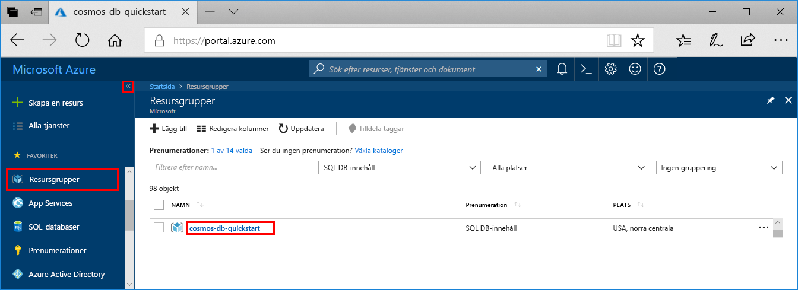
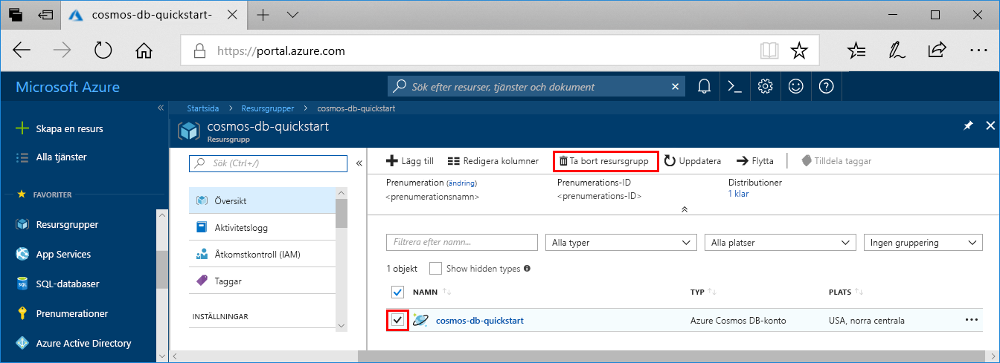

Om du inte planerar att fortsätta använda den här appen tar du bort alla resurser som skapades i snabbstarten med följande steg, så att inga kostnader uppstår:

1. Välj **Resursgrupper** i Azure Portal längst till vänster och välj sedan den resursgrupp du skapat.  

    Om den vänstra menyn döljs klickar du på  för att expandera den.

   

2. Markera resursgruppen i det nya fönstret och klicka sedan på **Ta bort resursgrupp**.

      

3. I det nya fönstret, skriv namnet på resursgruppen som ska tas bort och klicka sedan på **Ta bort**.

