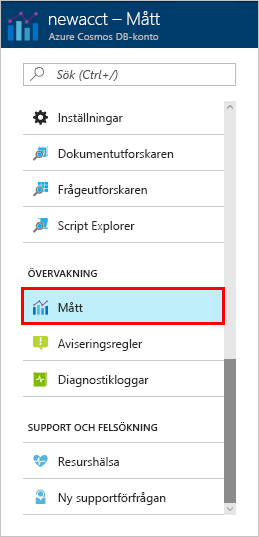
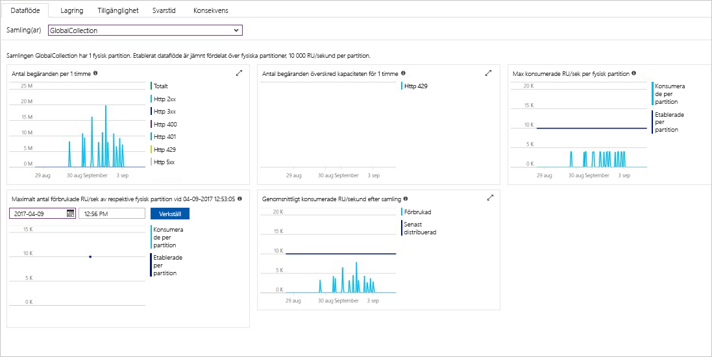

Dataflöde, lagring, tillgänglighet, svarstid och konsekvenskontroll av resurser i ditt konto övervakas i Azure-portalen. Låt oss ta en titt på de här måtten. 

1. Klicka på **mått** på navigeringsmenyn.

   

2. Klicka här för var och en av flikarna så att du är medveten om mått som ger Azure Cosmos DB. 

    Varje diagram som är associerad med den [Azure Cosmos DB servicenivåavtal (SLA)](https://azure.microsoft.com/support/legal/sla/cosmos-db/) innehåller en rad som visar om någon av SLA: er har överskridits. Azure Cosmos-DB kan du övervaka dina transparent med den här serien mått SLA: er. 

   