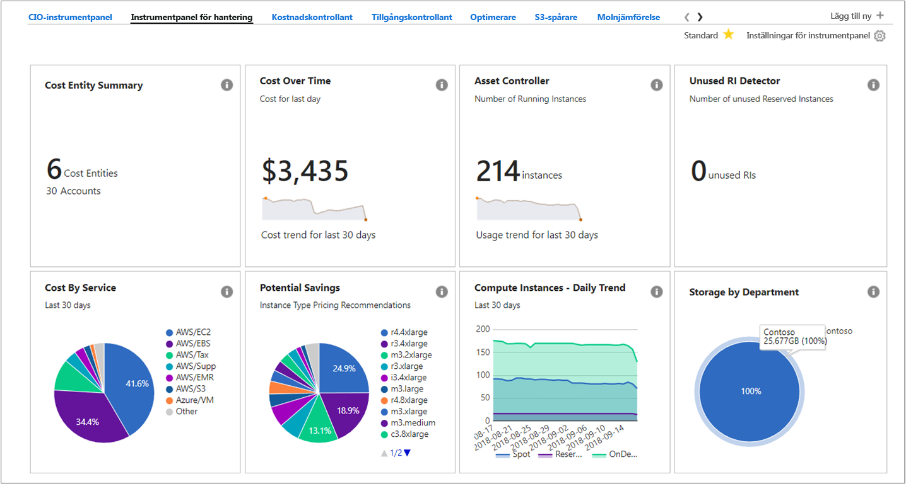
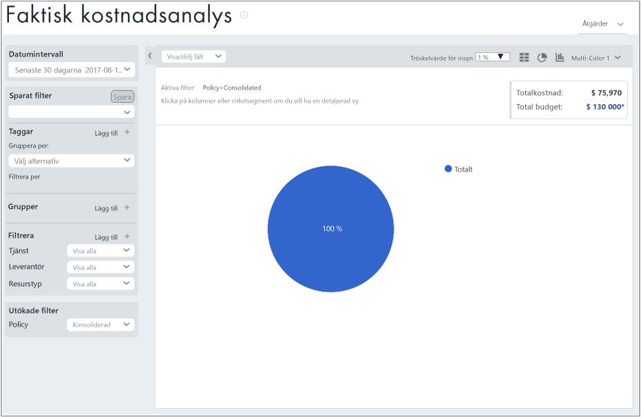
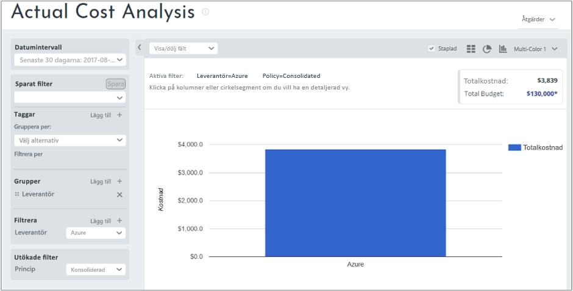
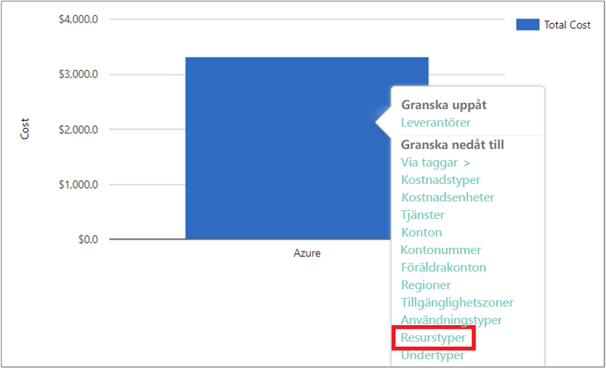
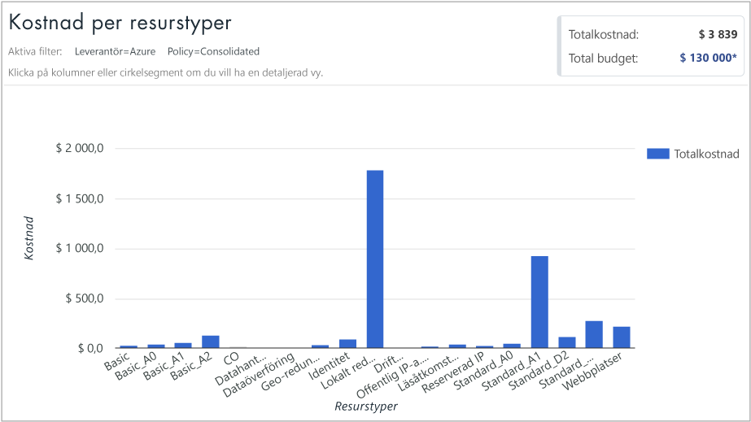
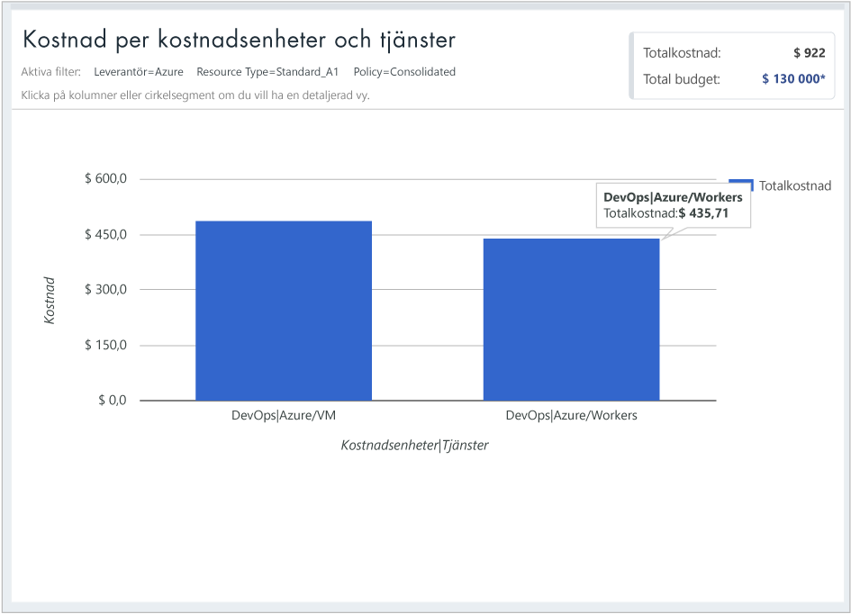

## Visa kostnadsdata

Azure Cost Management från Cloudyn ger dig åtkomst till alla dina molnresursdata. I instrumentpanelsrapporterna hittar du både standardrapporter och anpassade rapporter i en flikvy. Följande är exempel på en populär instrumentpanel och en rapport som visar dig kostnadsdata direkt.

I det här exemplet visar hanteringspanelen konsoliderade kostnader för företaget Contoso i alla molnresurser. Contoso använder Azure, AWS och Google. Instrumentpaneler ger översiktlig information och är snabba sätt att navigera till rapporter.  

Om du är osäker på rapportens syfte på en instrumentpanel hovrar du över **i**-symbolen så visas en förklaring. Klicka på valfri rapport på en instrumentpanel för att visa hela rapporten.

Du kan även visa rapporter i rapportmenyn högst upp i portalen. Vi tar en titt på utgifterna för Contosos Azure-resurs under de senaste 30 dagarna. Klicka på **Costs** (Kostnader) > **Cost Analysis** (Kostnadsanalys) > **Actual Cost Analysis** (Analys av faktiska kostnader). Rensa eventuella värden för taggar, grupper eller filter i rapporten.

I det här exemplet är 122 273 USD totalkostnaden och budgeten är 290 000 USD.

Nu ändrar vi rapportformatet och anger grupper och filter för att begränsa resultaten för Azure-kostnader. Ställ in **Date Range** (Datumintervall) på de senaste 30 dagarna. Klicka högst upp till höger på kolumnsymbolen för att formatera som ett stapeldiagram och välj **Provider** under Groups (Grupper). Ställ sedan in ett filter för **Provider** på **Azure**.

I det här exemplet var totalkostnaden för Azure-resurser 3 309 USD under de senaste 30 dagarna.

Högerklicka på fältet Provider (Azure) och öka detaljnivån till **Resource types** (Resurstyper).

Följande bild visar kostnaderna för Azure-resurser som Contoso har ådragit sig. Totalsumman var 3 309 USD. I det här exemplet var ungefär hälften av kostnaderna för virtuella Standard_A1-datorer och ungefär den andra hälften av kostnaderna var för olika Azure-tjänster och VM-instanser.

Högerklicka på en resurstyp och välj **Cost Entities** (Kostnadsenheter) för att visa kostnadsenheter och de tjänster som har förbrukat resursen. I följande exempelbild har lokalt redundant lagring angetts som resurstyp. Contoso | Azure/Storage förbrukade 15,65 USD. Teknik | Azure Storage förbrukade 164,25 USD. Delad infrastruktur | Azure/Storage förbrukade 116,58 USD. Den totala kostnaden för tjänsterna är 296 USD.

Om du vill se en självstudievideo om att visa dina molnfaktureringsdata kan du se [Analyzing your cloud billing data with Azure Cost Management by Cloudyn](https://youtu.be/G0pvI3iLH-Y) (Analysera molnfaktureringsdata med Azure Cost Management från Cloudyn).
