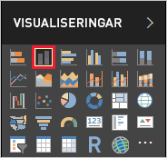
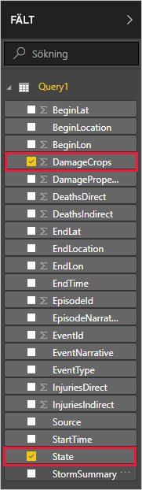
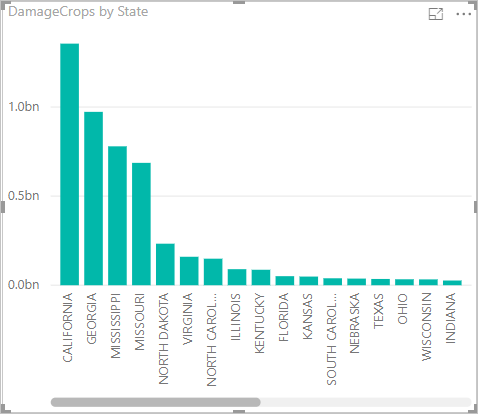

Nu när du har data i Power BI Desktop kan du skapa rapporter som baseras på dessa data. Du skapar en enkel rapport med ett stapeldiagram som visar skada på grödor per delstat.

1. På vänster sida i Power BI-huvudfönstret väljer du rapportvyn.

    

1. I fönstret **Visualiseringar** väljer du grupperat stapeldiagram.

    

    Ett tomt diagram har lagts till i arbetsytan.

    

1. I listan **FÄLT** väljer du **DamageCrops** och **Delstat**.

    

    Nu har du ett diagram som visar skadorna på grödor för de översta 1000 raderna i tabellen.

    

1. Spara rapporten.