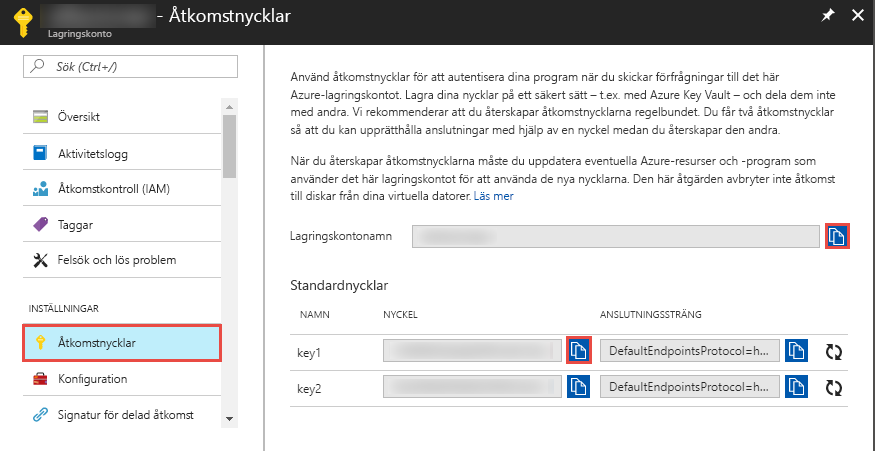

## <a name="prerequisites"></a>Nödvändiga komponenter

### <a name="azure-subscription"></a>Azure-prenumeration
Om du inte har en Azure-prenumeration kan du skapa ett [kostnadsfritt konto](https://azure.microsoft.com/free/) innan du börjar.

### <a name="azure-roles"></a>Azure-roller
Om du vill skapa Data Factory-instanser måste det användarkonto du använder för att logga in på Azure vara medlem av rollerna *deltagare* eller *ägare*, eller vara *administratör* för Azure-prenumerationen. Om du vill visa vilka behörigheter du har i prenumerationen öppnar du Azure-portalen, väljer användarnamnet i det övre högra hörnet och väljer sedan **Behörigheter**. Om du har åtkomst till flera prenumerationer väljer du rätt prenumeration. För exempel på instruktioner om hur du lägger till en användare till en roll läser du artikeln [Lägg till roller](../articles/billing/billing-add-change-azure-subscription-administrator.md).

För att skapa och hantera underordnade resurser (inklusive datauppsättningar, länkade tjänster, pipelines, utlösare och integrationskörningar) för Data Factory via redigerings- och övervakningsgränssnittet på Azure Portal måste du inneha rollen som **Data Factory-deltagare**. För att skapa och hantera underordnade resurser med PowerShell eller SDK räcker det att du har rollen som **deltagare**.

### <a name="azure-storage-account"></a>Azure Storage-konto
I den här snabbstarten använder du ett allmänt Azure Storage-konto (Blob Storage, för att vara specifik) som datalager för både *källa* och *destination*. Om du inte har något allmänt Azure Storage-konto finns det anvisningar om hur du skapar ett i artikeln [Skapa ett lagringskonto](../articles/storage/common/storage-quickstart-create-account.md). 

#### <a name="get-the-storage-account-name-and-account-key"></a>Hämta lagringskontots namn och åtkomstnyckel
Du använder namnet och nyckeln för Azure Storage-kontot i den här snabbstarten. Följande procedur innehåller steg för att få fram namnet och nyckeln för ditt lagringskonto: 

1. Öppna en webbläsare och gå till [Azure-portalen](https://portal.azure.com). Logga in med ditt användarnamn och lösenord för Azure. 
2. Välj **Fler tjänster** i den vänstra menyn, filtrera på nyckelordet **Lagring** och välj **Lagringskonton**.

   
3. Filtrera på ditt lagringskonto (om det behövs) i listan med lagringskonton och välj sedan ditt lagringskonto. 
4. Gå till sidan **Lagringskonto** och välj **Åtkomstnycklar** i menyn.

   
5. Kopiera värdena för fälten **Lagringskontots namn** och **Nyckel 1** till Urklipp. Klistra in dem i Anteckningar eller något annat redigeringsprogram och spara. Du använder det senare i den här snabbstarten.   

#### <a name="create-the-input-folder-and-files"></a>Skapa indatamapp och filer
I det här avsnittet skapar du en blobcontainer med namnet **adftutorial** i Azure Blob Storage. Skapa en mapp med namnet **input** i containern och ladda upp en exempelfil i indatamappen. 

1. På sidan **Lagringskonto** växlar du till **Översikt** och väljer sedan **Blobar**. 

   
2. På sidan **Blob Service** väljer du **+ Container** i verktygsfältet. 

       
3. I dialogrutan **Ny container** anger du **adftutorial** som namn och väljer **OK**. 

   
4. Välj **adftutorial** i listan med containrar. 

   
1. På sidan **Container** väljer du **Ladda upp** i verktygsfältet.  

   
6. På sidan **Ladda upp blob** väljer du **Avancerat**.

   
7. Starta **Anteckningar** och skapa en fil med namnet **emp.txt** och följande innehåll: Spara den i mappen **c:\ADFv2QuickStartPSH**. Skapa mappen **ADFv2QuickStartPSH** om den inte redan finns.
    
   ```
   John, Doe
   Jane, Doe
   ```    
8. På sidan **Ladda upp blob** i Azure-portalen bläddrar du till och väljer filen **emp.txt** för rutan **Filer**. 
9. Ange **input** som värde i rutan **Ladda upp till mapp**. 

        
10. Kontrollera att mappen är **input**, att filen är **emp.txt** och välj **Ladda upp**.
    
    Du bör se filen **emp.txt** och uppladdningens status i listan. 
12. Stäng sidan **Ladda upp blob** genom att klicka på **X** i hörnet. 

    
1. Låt sidan **Container** vara öppen. Du kommer att använda den för att bekräfta utdata i slutet av snabbstarten.