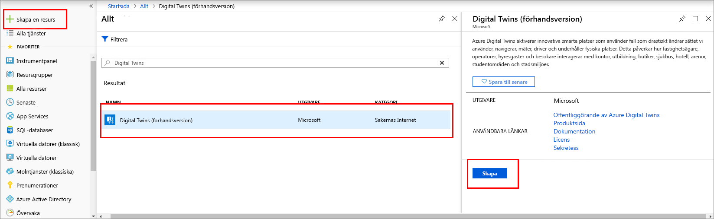
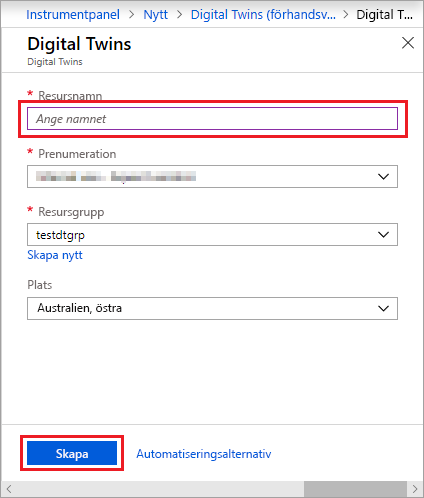
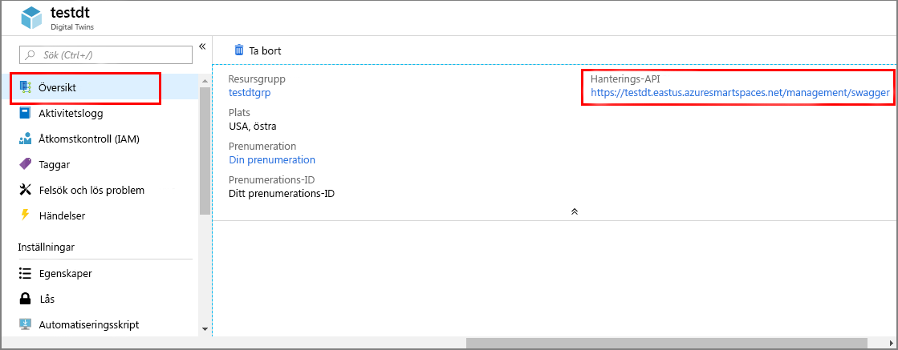

1. Logga in på [Azure-portalen](http://portal.azure.com).

1. Välj **Skapa en resurs** i fönstret till vänster. Sök efter **digital twins** och välj **Digital Twins (förhandsversion)**. Välj **Skapa** för att starta distributionsprocessen.

   

1. I fönstret **Digital Twins** anger du följande information:
   * **Resursnamn**: Skapa ett unikt namn på Digital Twins-instansen.
   * **Prenumeration**: Välj den prenumeration som du vill använda för att skapa Digital Twins-instansen. 
   * **Resursgrupp**: Välj eller skapa en [resursgrupp](https://docs.microsoft.com/azure/azure-resource-manager/resource-group-overview#resource-groups) för Digital Twins-instansen.
   * **Plats**: Välj den plats som är närmast enheterna.

    

1. Granska din Digital Twins-information och välj sedan **Skapa**. Det kan ta några minuter för Digital Twins-instansen att skapas. Du kan övervaka förloppet i **meddelandefönstret**.

1. Öppna **översiktsfönstret** för Digital Twins-instansen. Observera länken under **Hanterings-API**.

   URL:en för **hanterings-API** har formatet `https://yourDigitalTwinsName.yourLocation.azuresmartspaces.net/management/swagger`. Denna URL tar dig till dokumentationen för Azure Digital Twins REST API som gäller för din instans. Läs om [hur du använder Azure Digital Twins Swagger](../articles/digital-twins/how-to-use-swagger.md) för att få reda på hur du läser och använder den här API-dokumentationen.

    Ändra URL:en för **hanterings-API** till det här formatet: `https://yourDigitalTwinsName.yourLocation.azuresmartspaces.net/management/api/v1.0/`. Programmet använder den ändra URL:en som bas-URL för att få åtkomst till instansen. Kopiera denna ändrade URL till en temporär fil. Du behöver URL:en i nästa avsnitt.

    