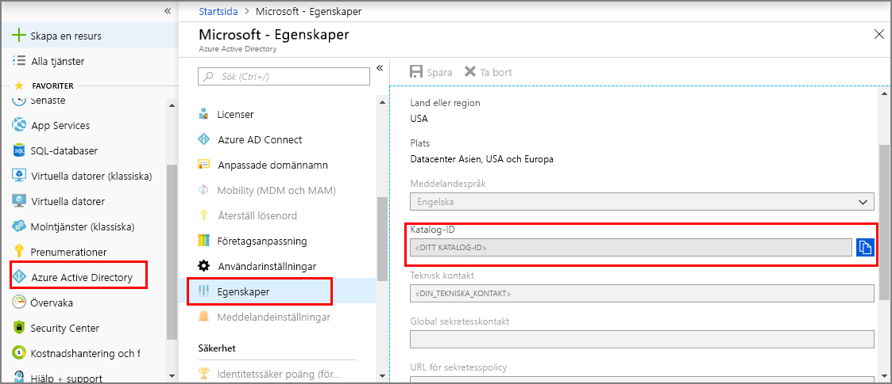
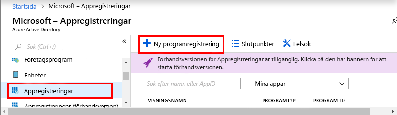
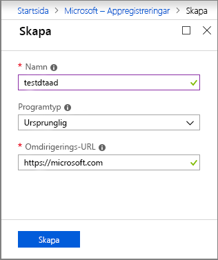
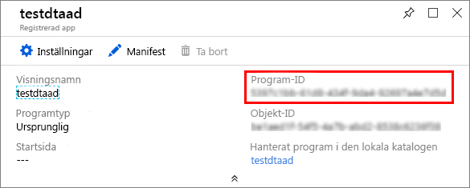
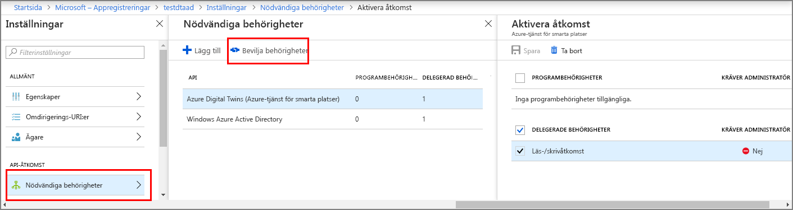

1. I [Azure-portalen](https://portal.azure.com)öppnar du **Azure Active Directory** från den vänstra panelen och öppnar sedan fönstret **Egenskaper**. Kopiera **katalog-ID:t** till en temporär fil. Du använder det här värdet för att konfigurera exempelprogrammet i nästa avsnitt.

    

1. Öppna fönstret **Appregistreringar** och välj sedan knappen **Ny programregistrering**.

    

1. Ge appregistreringen ett eget namn i rutan **Namn**. Ställ in **Programtyp** på **Intern** och  **	Omdirigerings-URI** som `https://microsoft.com`. Välj **Skapa**.

    

1. Öppna den registrerade appen och kopiera värdet för fältet **Program-ID** till en temporär fil. Det här värdet identifierar din Azure Active Directory-app. Du använder program-ID:t för att konfigurera exempelprogrammet i följande avsnitt.

    

1. Öppna fönstret för registrering av din app. Välj **Inställningar** > **Nödvändiga behörigheter** och sedan:

   a. Välj **Lägg till** längst upp till vänster för att öppna fönstret **Lägg till API-åtkomst**.

   b. Markera **Välj ett API** och sök efter **Azure Digital Twins**. Om sökningen inte hittar API:et söker du efter **Azure Smart Spaces** i stället.

   c. Välj **Azure Digital Twins (Azure Smart Spaces-tjänsten)** och sedan **Välj**.

   d. Välj **Välj behörigheter**. Markera kryssrutan för **läs-/skrivbehörighet** för delegerade behörigheter och markera **Välj**.

   e. Markera **Klar** i fönstret **Lägg till API-åtkomst**.

   f. I fönstret **Nödvändiga behörigheter** väljer du knappen **Bevilja behörigheter** och godkänner bekräftelsen som visas.

      
