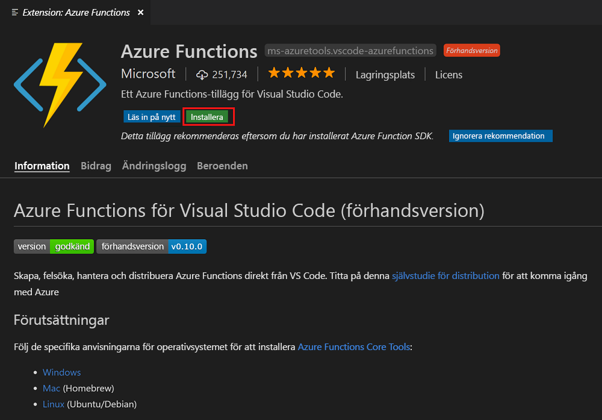
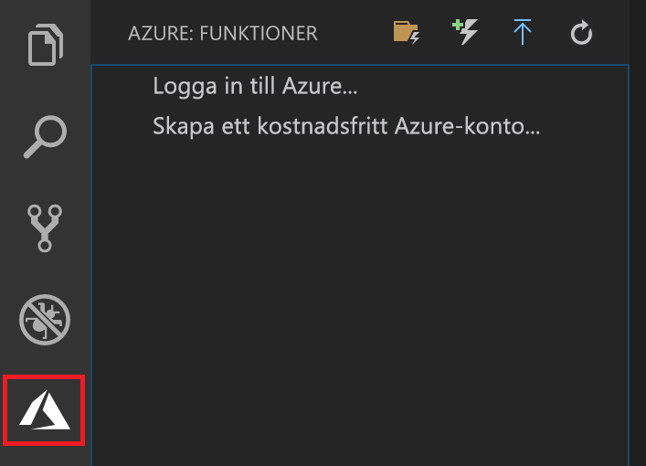

## Installera Azure Functions-tillägget

Azure Functions-tillägget används för att skapa, testa och distribuera funktioner till Azure.

1. Öppna **Tillägg** i Visual Studio Code och sök efter `azure functions`, eller [öppna den här länken i Visual Studio Code](vscode:extension/ms-azuretools.vscode-azurefunctions).

1. Välj **Installera** för att installera tillägget för Visual Studio Code.

    

1. Starta om Visual Studio Code och välj Azure-ikonen i aktivitetsfältet. Ett Azure Functions-område bör visas i sidofältet.

    