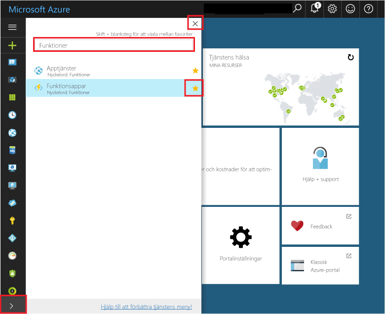
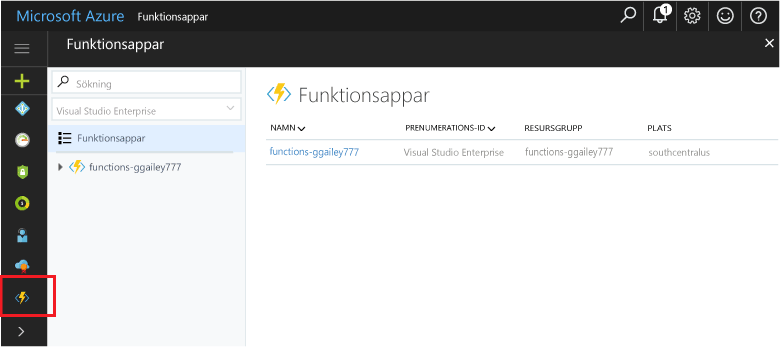

## Favorit funktioner i portalen 

Om du inte redan gjort det kan du lägga till funktionsappar i dina favoriter på Azure Portal. På så sätt blir det lättare att hitta dina funktionsappar. Om du redan har gjort det här kan du hoppa till nästa avsnitt. 

1. Logga in på [Azure-portalen](https://portal.azure.com/).

2. Klicka på pilen längst ned till vänster för att expandera alla tjänster, skriv `Functions` i fältet **Filter** och klicka sedan på stjärnan bredvid **Funktionsappar**.  
 
    

    Detta gör att funktionsikonen läggs till på menyn till vänster på portalen.

3. Stäng menyn och bläddra ned till slutet så att du ser funktionsikonen. Klicka på ikonen för att visa alla dina funktionsappar. Klicka på funktionsappen för att arbeta med funktionerna i den här appen. 
 
    
 
     