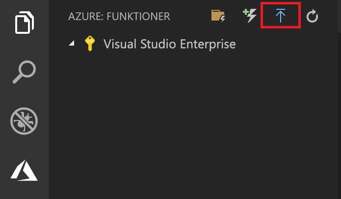

## Publicera projektet på Azure

I Visual Studio Code kan du publicera funktionsprojektet direkt på Azure. Samtidigt skapar du en funktionsapp och relaterade resurser i Azure-prenumerationen. Funktionsappen är ett körningssammanhang för dina funktioner. Projektet paketeras och distribueras till den nya funktionsappen i Azure-prenumerationen.

Den här artikeln förutsätter att du skapar en ny funktionsapp. 

> [!IMPORTANT]
> Om du publicerar till en befintlig funktionsapp skrivs innehållet i den appen över i Azure.

1. I den **Azure: Functions** området, Välj för att distribuera till Funktionsapp-ikon.

    

1. Om inte loggat in, uppmanas du att **logga in på Azure**. Du kan också **skapa ett kostnadsfritt konto**. Efter lyckad inloggning i webbläsaren, gå tillbaka till Visual Studio Code. 

1. Om du har flera prenumerationer **Välj en prenumeration** för funktionsappen, välj sedan **+ Skapa ny Funktionsapp i Azure**.

1. Ange ett globalt unikt namn som identifierar funktionsappen och tryck på Retur. Giltiga tecken i ett namn på en funktionsapp är `a-z`, `0-9` och `-`.

1. Välj **+ Skapa ny resursgrupp**, ange ett resursgruppsnamn, till exempel `myResourceGroup`, och tryck på Retur. Du kan också använda en befintlig resursgrupp.

1. Välj **+ Skapa nytt lagringskonto**, ange ett globalt unikt namn på det nya lagringskonto som ska användas av funktionsappen och tryck på Retur. Namnet på ett lagringskonto måste vara mellan 3 och 24 tecken långt och får endast innehålla siffror och gemener. Du kan också använda ett befintligt konto.

1. Välj en plats i en [region](https://azure.microsoft.com/regions/) nära dig eller nära andra tjänster som används av dina funktioner.

    När du trycker på RETUR, skapas följande Azure-resurser i din prenumeration:

    * **[Resursgrupp](../articles/azure-resource-manager/resource-group-overview.md)**: Innehåller alla de skapa Azure-resurserna. Namnet är baserad på din funktionsappens namn.
    * **[Storage-konto](../articles/storage/common/storage-quickstart-create-account.md)**: Ett standard Storage-konto har skapats med ett unikt namn som baseras på din funktionsappens namn.
    * **[Värdplan](../articles/azure-functions/functions-scale.md)**: En förbrukningsplan har skapats i regionen USA, västra som värd för din funktionsapp utan server.
    * **Funktionsapp**: Projektet distribueras till och körs i den nya funktionsappen.

    Ett meddelande visas när funktionsappen har skapats och distributionspaketet har tillämpats. Välj **visa utdata** i det här meddelandet att visa skapande och distributionsresultat, inklusive Azure-resurser som du skapade.

1. I den **Azure: Functions** området Expandera den nya funktionsappen i din prenumeration. Expandera **Functions**, högerklicka på **HttpTrigger**, och välj sedan **kopiera Funktionswebbadressen**.

    
