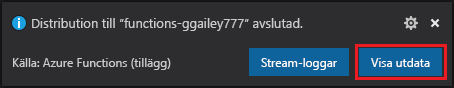
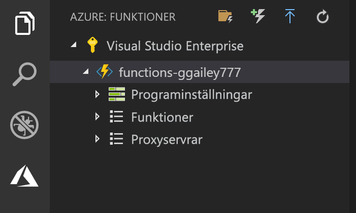

## Publicera projektet på Azure

I Visual Studio Code kan du publicera funktionsprojektet direkt på Azure. Samtidigt skapar du en funktionsapp och relaterade resurser i Azure-prenumerationen. Funktionsappen är ett körningssammanhang för dina funktioner. Projektet paketeras och distribueras till den nya funktionsappen i Azure-prenumerationen. 

Den här artikeln förutsätter att du skapar en ny funktionsapp. Om du publicerar till en befintlig funktionsapp skrivs innehållet i den appen över i Azure.

1. I området **Azure: Funktioner** väljer du ikonen Distribuera till funktionsapp.

    

1. Välj projektmappen, som är den aktuella arbetsytan.

1. Om du har fler än en prenumeration väljer du den där du vill lagra funktionsappen och väljer sedan **+ Skapa ny funktionsapp**.

1. Ange ett globalt unikt namn som identifierar funktionsappen och tryck på Retur. Giltiga tecken i ett namn på en funktionsapp är `a-z`, `0-9` och `-`.

1. Välj **+ Skapa ny resursgrupp**, ange ett resursgruppsnamn, till exempel `myResourceGroup`, och tryck på Retur. Du kan också använda en befintlig resursgrupp.

1. Välj **+ Skapa nytt lagringskonto**, ange ett globalt unikt namn på det nya lagringskonto som ska användas av funktionsappen och tryck på Retur. Namnet på ett lagringskonto måste vara mellan 3 och 24 tecken långt och får endast innehålla siffror och gemener. Du kan också använda ett befintligt konto.

1. Välj en plats i en [region](https://azure.microsoft.com/regions/) nära dig eller nära andra tjänster som används av dina funktioner.

    Funktionsappen börjar skapas när du har valt din plats. Ett meddelande visas när funktionsappen har skapats och distributionspaketet har tillämpats.

1. Välj **Visa utdata** i meddelandena om du vill visa skapande- och distributionsresultatet, inklusive Azure-resurserna som du har skapat.

    

1. Anteckna URL:en för den nya funktionsappen i Azure. Den använder du för att testa funktionen när projektet har publicerats till Azure.

    

1. I området **Azure: Funktioner** visas nu den nya funktionsappen under din prenumeration. När du expanderar den här noden visas funktionerna i funktionsappen, samt programinställningar och funktionsproxyservrar.

    

    Från funktionsappens nod Ctrl-klickar (högerklickar) du för att välja att utföra olika hanterings- och konfigurationsuppgifter för funktionsappen i Azure. Du kan också välja att visa funktionsappen på Azure-portalen.
