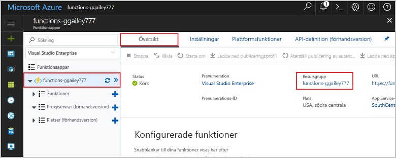

Andra snabbstarter i den här samlingen bygger på den här snabbstarten. Om du planerar att fortsätta att arbeta med efterföljande snabbstarter eller med självstudierna ska du inte rensa resurserna som skapas i denna snabbstart. 

Om du inte tänker fortsätta klickar du på **resursgruppen** för funktionsappen på portalen och sedan på **Ta bort**. 

