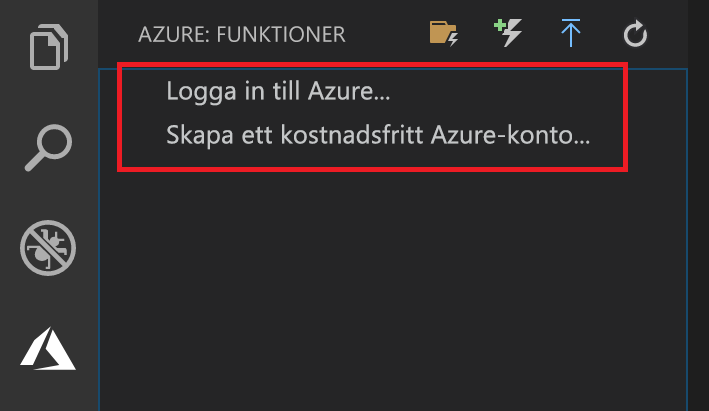

## Logga in på Azure

Innan du kan publicera appen måste du logga in på Azure.

1. Om du inte redan är inloggad väljer du Azure-ikonen i aktivitets fältet och väljer sedan **Logga in på Azure** i avsnittet **Azure: Functions** . Om du inte redan har en, kan du **[skapa ett kostnads fritt Azure-konto](https://azure.microsoft.com/free/)**. Studenter kan **[skapa ett kostnads fritt Azure-konto för studenter](https://azure.microsoft.com/free/students/)**.

    

    Om du redan är inloggad går du till nästa avsnitt.

1. När du uppmanas till webbläsaren väljer du ditt Azure-konto och loggar in med dina autentiseringsuppgifter för Azure-kontot.

1. När du har loggat in kan du stänga det nya webbläsarfönstret. De prenumerationer som tillhör ditt Azure-konto visas i sido fältet.
