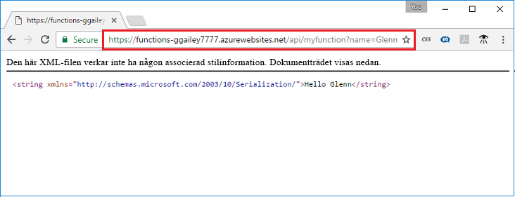

## <a name="test"></a>Testa funktionen

Använd cURL för att testa den distribuerade funktionen på en Mac- eller Linux-dator, eller med PowerShell i Windows. Kör följande cURL-kommando och ersätt platshållaren `<app_name>` med namnet på din funktionsapp. Lägg till frågesträngen `&name=<yourname>` i webbadressen.

```powershell
Invoke-WebRequest -Uri "https://<app_name>.azurewebsites.net/api/MyHttpTrigger?name=<yourname>"
```

```bash
curl https://<app_name>.azurewebsites.net/api/MyHttpTrigger?name=<yourname>
```  

  

Om `cURL`eller `Invoke-WebRequest` inte finns på kommandoraden anger du samma webbadress i webbläsarens adressfält. På samma sätt ersätter du platshållaren `<app_name>` med namnet på funktionsappen och lägger till frågesträngen `&name=<yourname>` i webbadressen.

    https://<app_name>.azurewebsites.net/api/MyHttpTrigger?name=<yourname>
   
  
