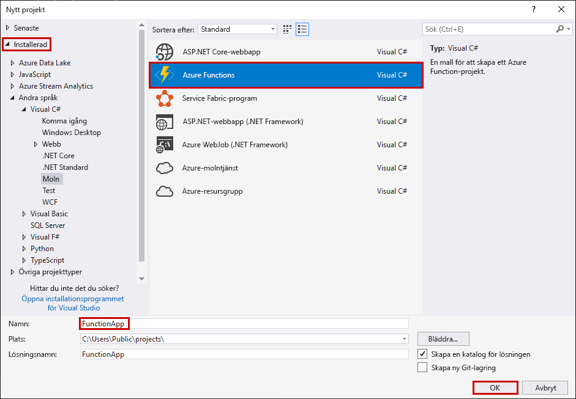
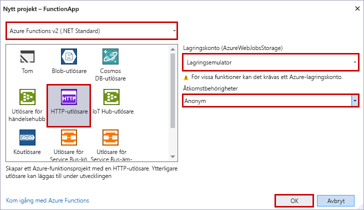

Med Azure Functions-projektmallen i Visual Studio skapas ett projekt som kan publiceras till en funktionsapp i Azure. Med en funktionsapp kan du gruppera funktioner som en logisk enhet så att det blir enklare att hantera, distribuera och dela resurser.

1. Välj **Nytt** > **Projekt** från **Arkiv**-menyn i Visual Studio.

2. I dialogrutan **Nytt projekt** väljer du **Installerat**, expanderar **Visual C#** > **Cloud**, väljer **Azure Functions**, skriver ett **namn** för projektet och klickar sedan på **OK**. Funktionsappens namn måste vara ett giltigt C#-namnområde. Du kan inte använda understreck, bindestreck eller andra icke-alfanumeriska tecken.

    

3. Använd inställningarna som anges i tabellen under bilden.

     

    | Inställning      | Föreslaget värde  | Beskrivning                      |
    | ------------ |  ------- |----------------------------------------- |
    | **Version** | Azure Functions 2.x  (.NET Core) | Med dessa inställningar skapas ett funktionsprojekt som använder körningsversion 2.x av Azure Functions, som har stöd för .Net Core. Azure Functions 1.x har stöd för .NET Framework. Läs mer i informationen om att [köra rätt körningsversion av Azure Functions](../articles/azure-functions/functions-versions.md).   |
    | **Mall** | HTTP-utlösare | Den här inställningen skapar en funktion som utlöses av en HTTP-begäran. |
    | **Lagringskonto**  | Lagringsemulator | HTTP-utlösare använder inte Storage-kontoanslutningen. Alla andra typer av utlösare kräver en giltig anslutningssträng för Storage-kontot. |
    | **Åtkomstbehörighet** | Anonym | Funktionen som skapats kan utlösas av alla klienter utan att en nyckel anges. Den här auktoriseringsinställningen gör det enkelt att testa den nya funktionen. Mer information om nycklar och auktorisering finns i avsnittet om [auktoriseringsnycklar](../articles/azure-functions/functions-bindings-http-webhook.md#authorization-keys) i avsnittet om [HTTP- och webhook-bindningar](../articles/azure-functions/functions-bindings-http-webhook.md). |
4. Klicka på **OK** för att skapa funktionsprojektet och den HTTP-utlösta funktionen.
