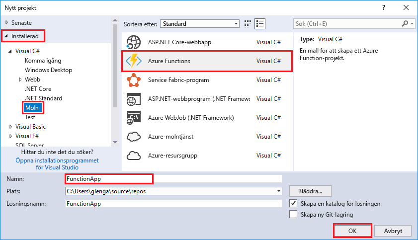

Med Azure Functions-projektmallen i Visual Studio skapas ett projekt som kan publiceras till en funktionsapp i Azure. I en funktionsapp kan du gruppera funktioner som en logisk enhet så att det blir enklare att hantera, distribuera och dela resurser.   

Högerklicka på projektnoden i **Solution Explorer** och välj sedan **Lägg till** > **Nytt objekt**. Välj **Azure Function** i dialogrutan.

I dialogrutan **Nytt projekt** expanderar du noden **Visual C#** > **Cloud**, väljer **Azure Functions**, anger ett **namn** för projektet och klickar på **OK**. Funktionsappens namn måste vara ett giltigt C#-namnområde. Du kan inte använda understreck, bindestreck eller andra icke-alfanumeriska tecken. 

