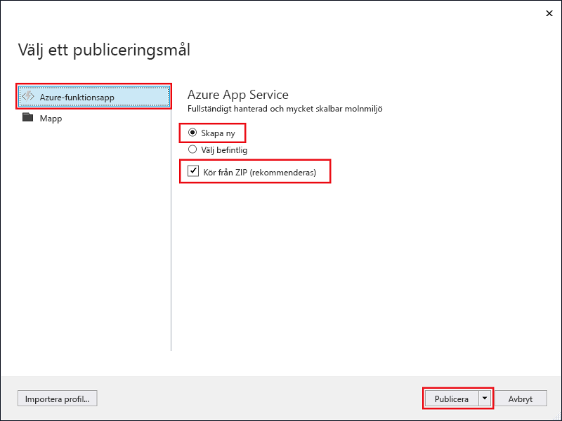

1. I **Solution Explorer** högerklickar du på projektet och väljer **Publicera**.

2. Välj **Azure-funktionsapp**, välj **Skapa ny** och välj sedan **Publicera**.

    

2. Om du inte redan har anslutit Visual Studio till ditt Azure-konto väljer du **Lägg till ett konto**.

3. I dialogrutan **Skapa App Service** använder du **värdinställningarna** som anges i tabellen under bilden:

    

    | Inställning      | Föreslaget värde  | Beskrivning                                |
    | ------------ |  ------- | -------------------------------------------------- |
    | **Appnamn** | Globalt unikt namn | Namn som unikt identifierar din nya funktionsapp. |
    | **Prenumeration** | Välj din prenumeration | Den Azure-prenumeration som ska användas. |
    | **[Resursgrupp](../articles/azure-resource-manager/resource-group-overview.md)** | myResourceGroup |  Namnet på resursgruppen som funktionsappen ska skapas i. Skapa en ny resursgrupp genom att välja **Ny**.|
    | **[App Service-plan](../articles/azure-functions/functions-scale.md)** | Förbrukningsplan | Välj **Förbrukning** under **Storlek** när du har klickat på **Ny** för att skapa en plan. Välj också en **plats** i en [region](https://azure.microsoft.com/regions/) nära dig eller nära andra tjänster som används av dina funktioner.  |
    | **[Lagringskonto](../articles/storage/common/storage-create-storage-account.md#create-a-storage-account)** | Lagringskonto för generell användning | Azure Functions-körmiljön kräver ett Azure Storage-konto. Klicka på **Ny** för att skapa ett lagringskonto för generell användning, eller använd ett befintligt.  |

4. Klicka på **Skapa** för att skapa en funktionsapp och relaterade resurser i Azure med dessa inställningar och distribuera koden för funktionsprojektet. 

5. När distributionen är klar skriver du ned värdet för **Plats-URL**. Det här är funktionsappens adress i Azure.

    
