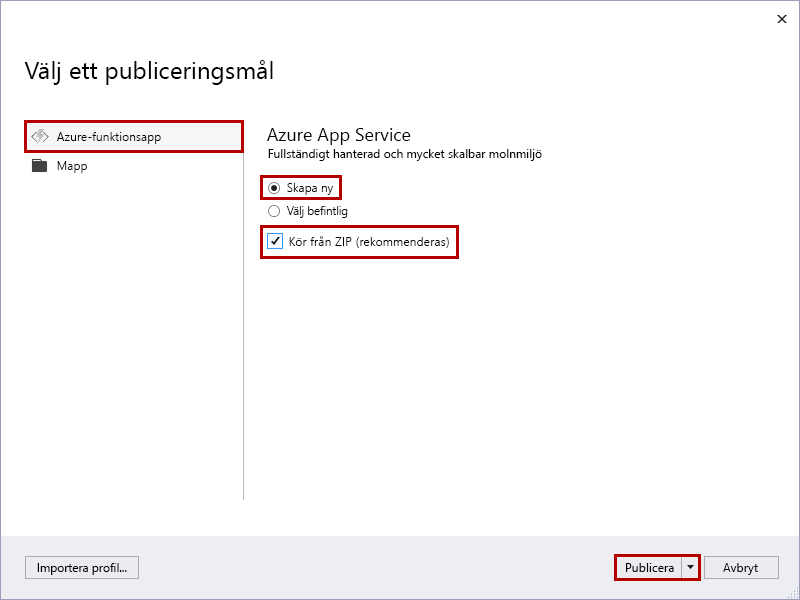
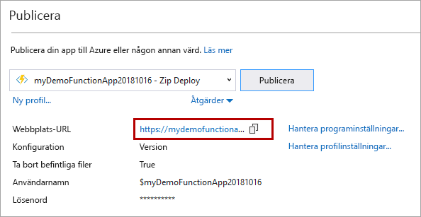

1. I **Solution Explorer** högerklickar du på projektet och väljer **Publicera**.

2. I **Välj ett publiceringsmål**använder du de publiceringsalternativ som anges i följande tabell: 

    | Alternativ      | Beskrivning                                |
    | ------------ |  -------------------------------------------------- |
    | **Azure-funktionsapp** | Skapa en funktionsapp i en Azure-molnmiljö. | 
    | **Skapa nya** | En ny funktionsapp, med relaterade resurser, skapas i Azure.  Om du väljer **Välj befintlig**skrivs alla filer i den befintliga funktionsappen i Azure över av filer från det lokala projektet. Använd det här alternativet endast när du publicerar om uppdateringar till en befintlig funktionsapp. |
    | **Kör från paketfil** | Din funktionsapp distribueras med [Zip Deploy](../articles/azure-functions/functions-deployment-technologies.md#zip-deploy) med [kör-från-paket-läge](../articles/azure-functions/run-functions-from-deployment-package.md) aktiverat. Den här distributionen, som resulterar i bättre prestanda, är det rekommenderade sättet att köra dina funktioner.  Om du inte använder det här alternativet måste du stoppa ditt funktionsappprojekt från att köras lokalt innan du publicerar till Azure. |

    

3. Välj **Publicera**. Om du inte redan har loggat in på ditt Azure-konto från Visual Studio väljer du **Logga in**. Du kan också skapa ett kostnadsfritt Azure-konto.

4. I **Azure App Service: Skapa nya**använder du de värden som anges i följande tabell:

    | Inställning      | Värde  | Beskrivning                                |
    | ------------ |  ------- | -------------------------------------------------- |
    | **Namn** | Globalt unikt namn | Namn som unikt identifierar din nya funktionsapp. Acceptera det här namnet eller ange ett nytt namn. Giltiga tecken `a-z`är: `0-9` `-`, och . |
    | **Prenumeration** | Din prenumeration | Den Azure-prenumeration som ska användas. Acceptera den här prenumerationen eller välj en ny i listrutan. |
    | **[Resursgrupp](../articles/azure-resource-manager/management/overview.md)** | Namn på resursgruppen |  Resursgruppen där funktionsappen ska skapas. Välj en befintlig resursgrupp i listrutan eller välj **Nytt** för att skapa en ny resursgrupp.|
    | **[Hosting Plan](../articles/azure-functions/functions-scale.md)** | Namn på din värdplan | Välj **Ny** om du vill konfigurera en serverlös plan. Se till att välja **Förbrukning** under **Storlek**. När du publicerar projektet i en funktionsapp som körs i en [förbrukningsplan](../articles/azure-functions/functions-scale.md#consumption-plan)betalar du bara för körningar av din funktionsapp. Andra hosting planer medför högre kostnader. Om du kör i en annan plan än **Förbrukning**måste du hantera [skalningen av funktionsappen](../articles/azure-functions/functions-scale.md). Välj en **plats** i en [region](https://azure.microsoft.com/regions/) nära dig eller andra tjänster som dina funktioner har åtkomst till.  |
    | **[Azure-lagring](../articles/storage/common/storage-account-create.md)** | Allmänt lagringskonto | Ett Azure Storage-konto krävs av funktionskörningen. Välj **Ny** om du vill konfigurera ett allmänt lagringskonto. Du kan också välja ett befintligt konto som uppfyller kraven för [lagringskonto](../articles/azure-functions/functions-scale.md#storage-account-requirements).  |

    

5. Välj **Skapa** om du vill skapa en funktionsapp och dess relaterade resurser i Azure med dessa inställningar och distribuera din funktionsprojektkod. 

6. När distributionen är klar gör du en anteckning om **värdet för webbplatsens URL,** som är adressen till din funktionsapp i Azure.

    
