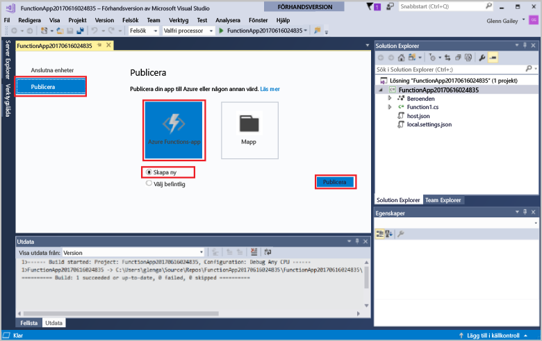
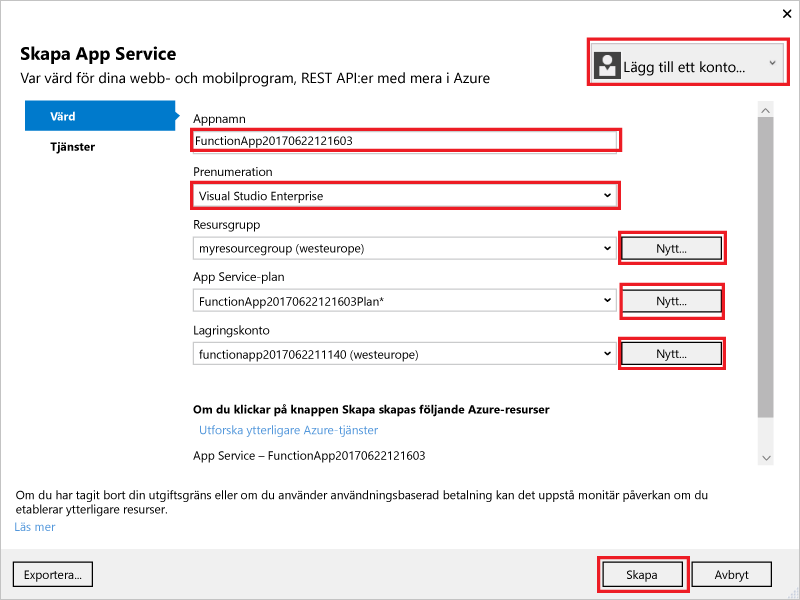
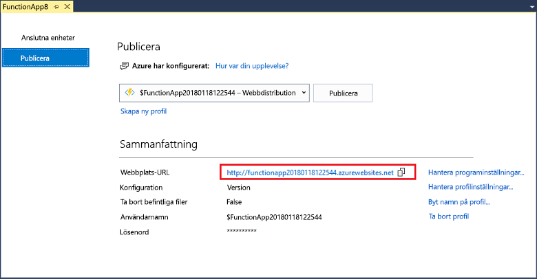

I **Solution Explorer** högerklickar du på projektet och väljer **Publicera**. Välj **Skapa ny** och klicka sedan på **Publicera**. 

Om du inte redan har anslutit Visual Studio till ditt Azure-konto klickar du på **Lägg till ett konto...**.  

I dialogrutan **Create App Service** (Skapa App Service) använder du värdinställningarna som anges i tabellen. 

| Inställning      | Föreslaget värde  | Beskrivning                                |
| ------------ |  ------- | -------------------------------------------------- |
| **Appnamn** | Globalt unikt namn | Namn som unikt identifierar din nya funktionsapp. |
| **Prenumeration** | Välj din prenumeration | Den Azure-prenumeration som ska användas. |
| **[Resursgrupp](../articles/azure-resource-manager/resource-group-overview.md)** | myResourceGroup |  Namnet på resursgruppen som funktionsappen ska skapas i. |
| **[App Service-plan](../articles/azure-functions/functions-scale.md)** | Förbrukningsplan | Se till att du väljer **Förbrukning** under **Storlek** när du skapar en ny plan.  |
| **[Lagringskonto](../articles/storage/storage-create-storage-account.md#create-a-storage-account)** | Globalt unikt namn | Använd ett befintligt lagringskonto eller skapa ett nytt.   |

Klicka på **Skapa** för att skapa en funktionsapp i Azure med de här inställningarna. 

När etableringen är klar klickar du på **Publicera** för att distribuera projektkoden till den nya funktionsappen. 

Anteckna värdet för **Plats-URL**. Det är adressen till funktionsappen i Azure. 