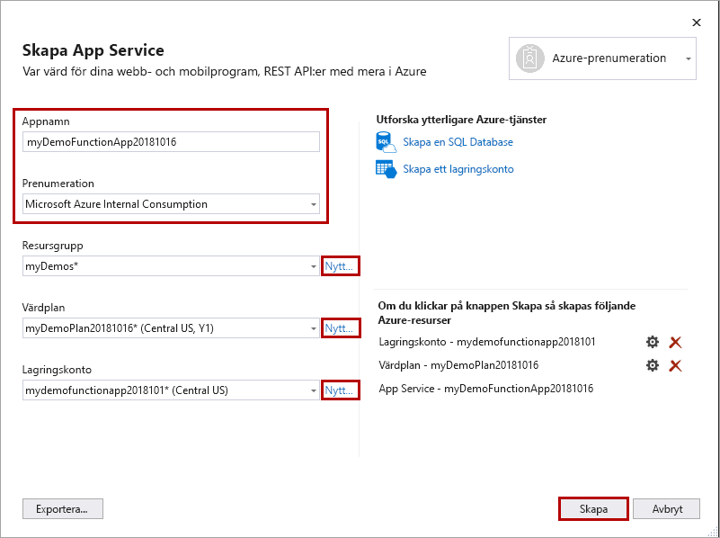

1. I **Solution Explorer** högerklickar du på projektet och väljer **Publicera**.

1. I **mål** väljer du **Azure** :::image type="content" source="media/functions-vstools-publish/functions-visual-studio-publish-profile-step-1.png" alt-text="Välj Azure-mål":::

1. I ett **särskilt mål** väljer du **Azure Funktionsapp (Windows)**

    :::image type="content" source="media/functions-vstools-publish/functions-visual-studio-publish-profile-step-2.png" alt-text="Välj Azure-Funktionsapp":::

1. I **funktions instans** väljer du **skapa en ny Azure function...** och använder sedan de värden som anges i följande tabell:

    | Inställning      | Värde  | Beskrivning                                |
    | ------------ |  ------- | -------------------------------------------------- |
    | **Namn** | Globalt unikt namn | Namn som unikt identifierar din nya funktionsapp. Acceptera det här namnet eller ange ett nytt namn. Giltiga tecken är: `a-z` , `0-9` , och `-` . |
    | **Prenumeration** | Din prenumeration | Den Azure-prenumeration som ska användas. Godkänn denna prenumeration eller Välj en ny i list rutan. |
    | **[Resurs grupp](../articles/azure-resource-manager/management/overview.md)** | Namnet på din resurs grupp |  Resurs gruppen där du vill skapa din Function-app. Välj en befintlig resurs grupp i den nedrullningsbara listan eller Välj **ny** för att skapa en ny resurs grupp.|
    | **[Typ av plan](../articles/azure-functions/functions-scale.md)** | Förbrukning | När du publicerar projektet till en Function-app som körs i en [förbruknings plan](../articles/azure-functions/functions-scale.md#consumption-plan)betalar du bara för körningar av Functions-appen. Andra värd planer ådrar sig högre kostnader. |
    | **Plats** | Platsen för App Service | Välj en **plats** i en [region](https://azure.microsoft.com/regions/) nära dig eller andra tjänster som dina funktioner har åtkomst till. |
    | **[Azure Storage](../articles/storage/common/storage-account-create.md)** | Allmänt lagrings konto | Ett Azure Storage-konto krävs av Functions-körningen. Välj **nytt** om du vill konfigurera ett allmänt lagrings konto. Du kan också välja ett befintligt konto som uppfyller [kraven för lagrings kontot](../articles/azure-functions/functions-scale.md#storage-account-requirements).  |

    

1. Välj **skapa** för att skapa en Function-app och dess relaterade resurser i Azure. 
1. I **Functions-instansen** kontrollerar du att **Kör från paket filen** är markerat. Din Function-app distribueras med hjälp av [zip Deploy](../articles/azure-functions/functions-deployment-technologies.md#zip-deploy) med läget [Kör-från-Package](../articles/azure-functions/run-functions-from-deployment-package.md) aktiverat. Detta är den rekommenderade distributions metoden för ditt Functions-projekt, eftersom den resulterar i bättre prestanda. 

    :::image type="content" source="media/functions-vstools-publish/functions-visual-studio-publish-profile-step-4.png" alt-text="Slutför skapande av profil":::

1. Välj **Slutför** och på sidan publicera väljer du **publicera** för att distribuera paketet som innehåller dina projektfiler till din nya Function-app i Azure. 

    När distributionen är klar visas rot-URL: en för Function-appen i Azure på fliken **publicera** . 
    
1.  På fliken publicera väljer du **Hantera i Cloud Explorer**. Då öppnas Azure-resursen ny function-app i Cloud Explorer. 
    
    :::image type="content" source="media/functions-vstools-publish/functions-visual-studio-publish-complete.png" alt-text="Meddelande som anger att publiceringen lyckades":::
    
    Med Cloud Explorer kan du använda Visual Studio för att visa innehållet på platsen, starta och stoppa-appen och bläddra direkt för att söka efter app-resurser i Azure och i Azure Portal. 
