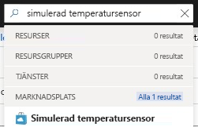
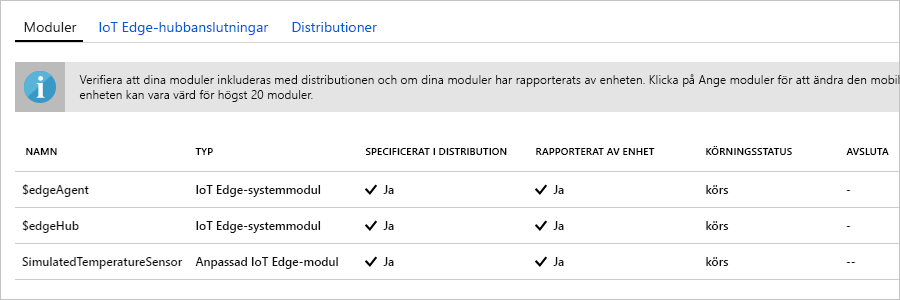

En av de viktigaste funktionerna i Azure IoT Edge är möjligheten att distribuera moduler till IoT Edge-enheter från molnet. En IoT Edge-modul är ett körbart paket som implementeras som en container. I det här avsnittet distribuerar vi en färdig modul från avsnittet [IoT Edge-moduler i Azure Marketplace](https://azuremarketplace.microsoft.com/marketplace/apps/category/internet-of-things?page=1&subcategories=iot-edge-modules). Den här modulen genererar simulerad telemetri för IoT Edge-enheten.

1. På [Azure-portalen](https://portal.azure.com) anger du **Simulerad temperatursensor** i sökningen och öppnar Marketplace-resultatet.

   

2. Välj vilken IoT Edge-enhet som ska ta emot modulen. Under **Målenheter för IoT Edge-enheter** anger du följande information:

   1. **Prenumeration**: Välj den prenumeration som innehåller IoT-hubben som du använder.

   2. **IoT Hub**: Välj namnet på IoT-hubben som du använder.

   3. **IoT Edge-enhetsnamn**: Om du tidigare i snabbstarten använde det föreslagna enhetsnamnet anger du **myEdgeDevice**. Eller välj **Hitta enhet** för att välja från en lista över enheter i IoT-hubben. 
   
   4. Välj **Skapa**.

3. När du har valt en IoT Edge-modul från Azure Marketplace, samt valt den IoT Edge-enhet som ska ta emot modulen, kommer du till en trestegsguide som hjälper dig att definiera exakt hur modulen ska distribueras. I steget **Lägg till moduler** i guiden ska du observera att modulen **SimulatedTemperatureSensor** är automatiskt ifylld. I självstudierna använder du den här sidan för att lägga till ytterligare moduler i distributionen. I den här snabbstarten distribuerar du den här modulen enbart. Välj **Nästa** för att fortsätta till nästa steg i guiden.

4. I steget **Ange vägar** i guiden definierar du hur meddelanden skickas mellan moduler och IoT Hub. I snabbstarten vill du att alla meddelanden från alla moduler går till IoT Hub (`$upstream`). Om det inte fyllts i automatiskt lägger du till följande kod och väljer **Nästa**:

   ```json
    {
    "routes": {
        "route": "FROM /messages/* INTO $upstream"
        }
    }
   ```

5. I steget **Granska distribution** i guiden kan du förhandsgranska JSON-filen som definierar alla moduler som distribueras till din IoT Edge-enhet. Observera att modulen **SimulatedTemperatureSensor** innefattas samt två ytterligare systemmoduler som kallas **edgeAgent** och **edgeHub**. Välj **Skicka** när du är klar med granskningen.

   När du skickar en ny distribution till en IoT Edge-enhet distribueras ingenting till enheten. I stället frågar enheten regelbundet IoT Hub efter nya instruktioner. När den ser den nya distributionsinformationen använder enheten den för att hämta modulbilder från molnet och börjar köra modulerna lokalt. Den här processen kan ta ett par minuter. 

6. När du har skickat modulens distributionsinformation tar guiden dig tillbaka till sidan **IoT Edge** i din IoT-hubb. Välj din enhet från listan över IoT Edge-enheter för att se dess information. 

7. På sidan med enhetsinformation rullar du ned till avsnittet **Moduler**. Tre moduler bör visas: $edgeAgent, $edgeHub och SimulatedTemperatureSensor. Om en eller fler av modulerna visas i distributionen men inte rapporteras av enheten innebär det att din IoT Edge-enhet fortfarande håller på att starta dem. Vänta en stund och välj sedan **Uppdatera** överst på sidan. 

   
