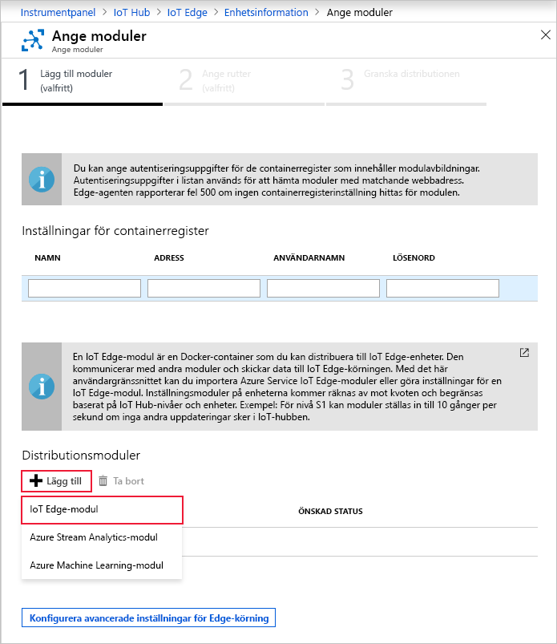
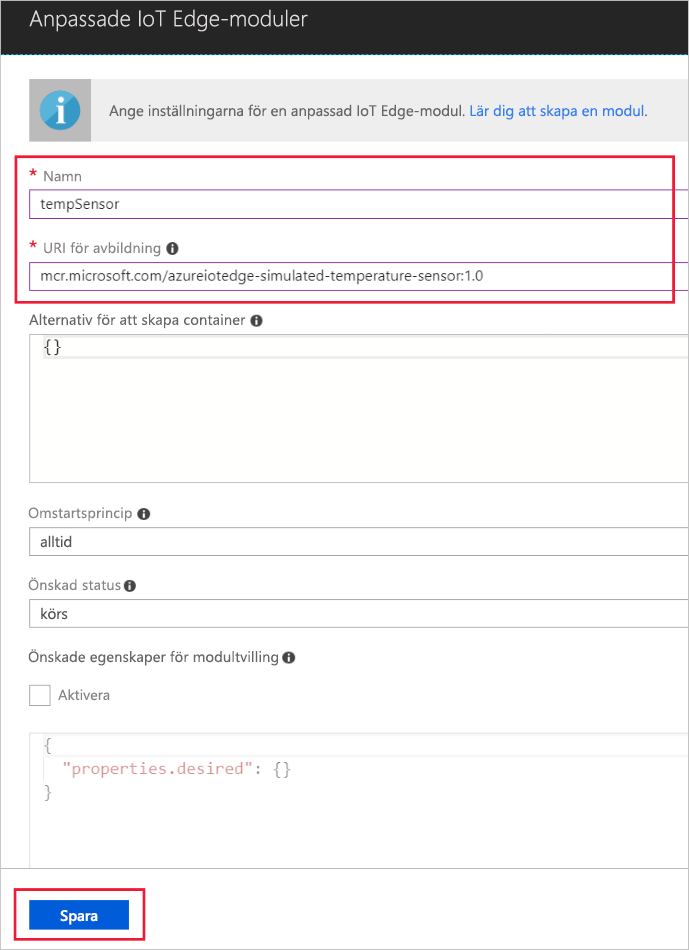

En av de viktigaste funktionerna i Azure IoT Edge är möjligheten att distribuera moduler till IoT Edge-enheter från molnet. En IoT Edge-modul är ett körbart paket som implementeras som en container. I det här avsnittet ska du distribuera en modul som genererar telemetri för din simulerade enhet.

1. Gå till din IoT-hubb på Azure Portal.

2. Gå till **IoT Edge** under **Automatisk enhetshantering** och välj din IoT Edge-enhet.

3. Välj **Ange moduler**. En guide med tre steg öppnas i portalen, som vägleder dig genom att lägga till moduler, ange vägar och granska distributionen. 

4. I steget **Lägg till moduler** i guiden letar du upp avsnittet **Distributionsmoduler**. Klicka på **Lägg till** och välj **IoT Edge-modul**.

   

5. I **Namn**-fältet skriver du `tempSensor`.

6. I **URI för avbildning**-fältet skriver du `mcr.microsoft.com/azureiotedge-simulated-temperature-sensor:1.0`.

7. Lämna de andra inställningarna som de är och välj **Spara**.

   

8. Väl tillbaka i första steget i guiden väljer du **Nästa**.

9. I steget **Ange rutter** i guiden ska du ha en standardväg som skickar alla meddelanden från alla moduler till IoT Hub. Om du inte har det lägger du till följande kod och väljer sedan **Nästa**.

   ```json
   {
       "routes": {
           "route": "FROM /messages/* INTO $upstream"
       }
   }
   ```

10. I steget **Granska distribution** i guiden väljer du **Skicka**.

11. Återgå till informationssidan om enheten och välj **Uppdatera**. Förutom edgeAgent-modulen som skapades när du startade tjänsten för första gången ska du även se en annan körningsmodul med namnet **edgeHub** och modulen **tempSensor**.

   Det kan ta några minuter för de nya modulerna att visas. IoT Edge-enheten måste hämta sin nya distributionsinformation från molnet, starta containrarna och rapportera sin nya status tillbaka till IoT Hub. 

   
