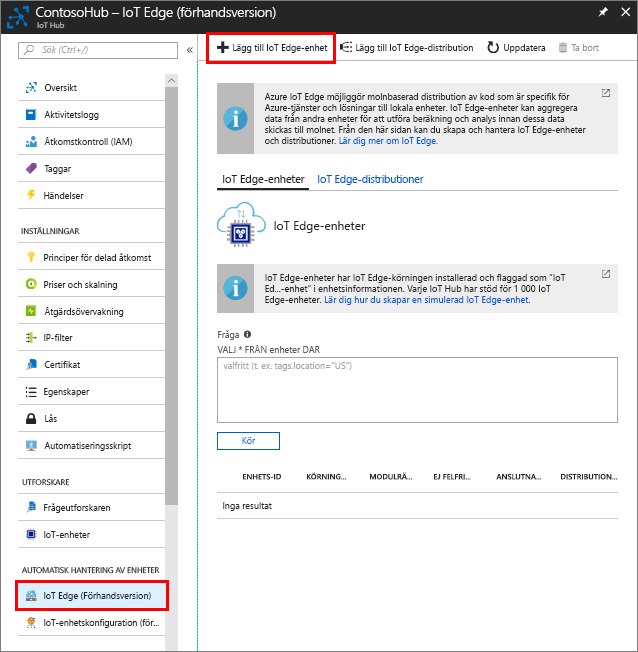

Skapa en enhetsidentitet för den simulerade enheten så att den kan kommunicera med din IoT Hub. Eftersom IoT Edge-enheter fungerar och kan hanteras på annat sätt än typiska IoT-enheter, kan du ange denna som en IoT Edge-enhet från början. 

1. Gå till din IoT-hubb på Azure Portal.
1. Välj **IoT Edge** och sedan **Lägg till IoT Edge-enhet**.

   

1. Ge den simulerade enheten ett unikt enhets-ID.
1. Välj **Spara** för att lägga till din enhet.
1. Välj den nya enheten i enhetslistan.
1. Kopiera värdet för **Anslutningssträng – primär nyckel** och spara det. Du behöver det här värdet för att konfigurera IoT Edge-körningen i nästa avsnitt. 

