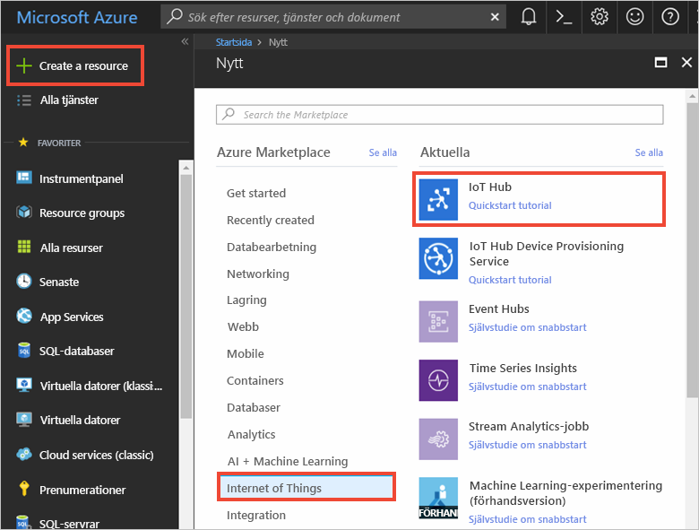
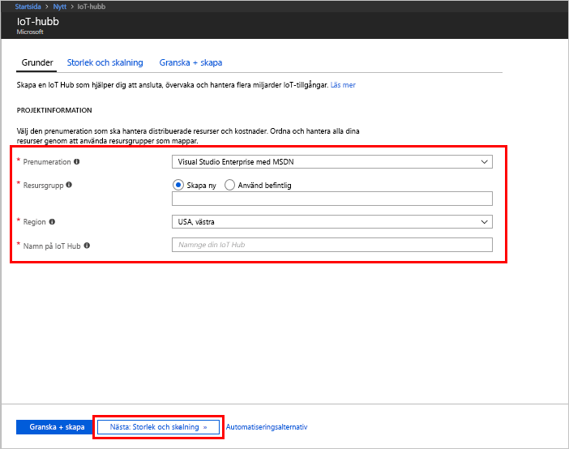
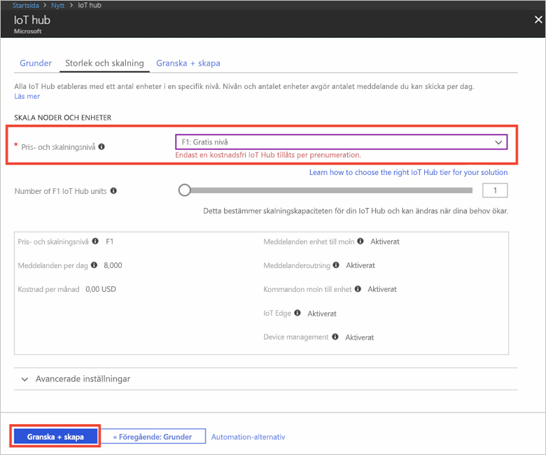

1. Logga in på [Azure-portalen](https://portal.azure.com/).

2. Välj **Skapa en resurs** > **Sakernas internet** > **IoT Hub**.
   
    

3. I rutan **IoT-hubb** anger du följande information för IoT-hubben:

   * **Prenumeration**: Välj den prenumeration som du vill använda för att skapa IoT-hubben.

   * **Resursgrupp**: Skapa en resursgrupp som ska vara värd för IoT-hubben eller använd en befintlig. Mer information finns i [Använda resursgrupper för att hantera Azure-resurser](../articles/azure-resource-manager/resource-group-portal.md).

   * **Region**: Välj den plats som är närmast dig.

   * **Namn**: Skapa ett namn för din IoT Hub. Om namnet som du anger är tillgängligt visas en grön bockmarkering.

   [!INCLUDE [iot-hub-pii-note-naming-hub](iot-hub-pii-note-naming-hub.md)]

   

4. Välj **Nästa: Storlek och skalning** för att fortsätta att skapa IoT-hubben. 

5. Välj **pris- och skalningsnivå**. I den här artikeln väljer du **F1 – kostnadsfri nivå** om den nivån fortfarande är tillgänglig för din prenumeration. Mer information finns i avsnittet om [pris- och skalnivåer](https://azure.microsoft.com/pricing/details/iot-hub/).

   

6. Välj **Granska + skapa**.

7. Gå igenom informationen om IoT-hubben och klicka sedan på **Skapa**. Det kan ta några minuter innan IoT-hubben har skapats. Du kan övervaka förloppet i **meddelandefönstret**.