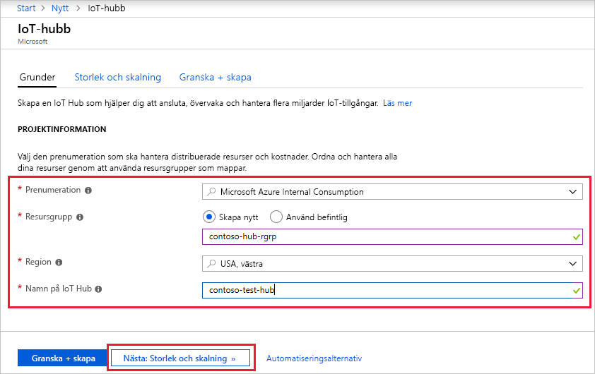
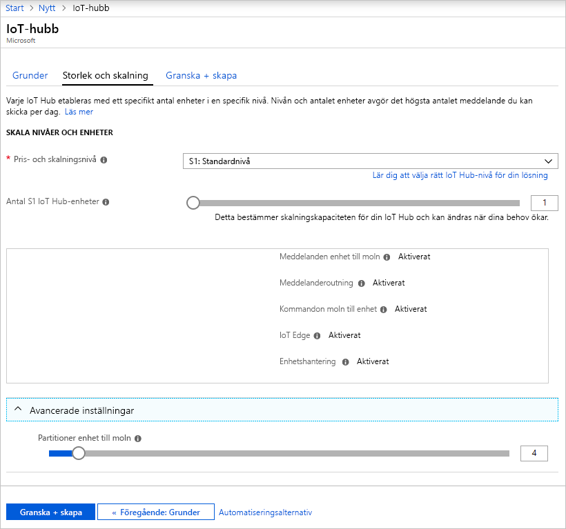
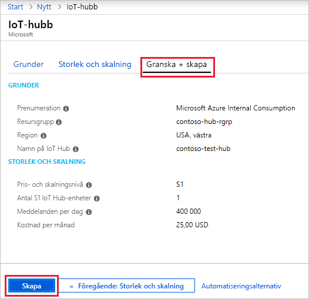

I det här avsnittet beskrivs hur du använder [Azure-portalen](https://portal.azure.com) för att skapa en IoT-hubb.

1. Logga in på [Azure-portalen](https://portal.azure.com). 

2. Välj +**skapa en resurs**, sedan *Sök på Marketplace* för den **IoT Hub**.

3. Välj **IoT Hub** och klicka på den **skapa** knappen. Du ser den första skärmen för att skapa en IoT-hubb.

   

   Fyll i fälten.

   **Prenumeration**: Välj den prenumeration som du vill använda för din IoT-hubb.

   **Resursgrupp**: Du kan skapa en ny resursgrupp eller välja en befintlig. Klicka på **Skapa ny** för att skapa en ny och ange namnet som du vill använda. Om du vill använda en befintlig resursgrupp väljer du **Använd befintlig** och väljer en resursgruppen i listrutan. Mer information finns i [Hantera Azure Resource Manager-resursgrupper](../articles/azure-resource-manager/manage-resource-groups-portal.md).

   **Region**: Det här är den region som du vill att din hubb ska finnas i. Välj platsen som är närmast dig från listrutan.

   **Namn på IoT-hubb**: Ange ett namn för IoT-hubben. Det här namnet måste vara globalt unikt. Om namnet som du anger är tillgängligt visas en grön bockmarkering.

   [!INCLUDE [iot-hub-pii-note-naming-hub](iot-hub-pii-note-naming-hub.md)]

4. Klicka på **Nästa: Storlek och skalning** för att fortsätta att skapa IoT-hubben.

   

   På den här skärmen kan du ta standardvärdena och klicka bara på **Granska + skapa** längst ned på sidan. 

   **Pris- och skalningsnivå**: Du kan välja bland flera nivåer beroende på hur många funktioner du vill ha och hur många meddelanden du skickar via din lösning per dag. Den kostnadsfria nivån är avsedd för testning och utvärdering. Det gör att 500 enheter kan anslutas till IoT-hubben och upp till 8 000 meddelanden per dag. Varje Azure-prenumeration kan skapa en IoT-hubb på den kostnadsfria nivån. 

   **IoT Hub-enheter**: Det antal meddelanden som tillåts per enhet per dag beror på hubbens prisnivå. Om du till exempel vill att IoT-hubben ska stödja ingångshändelser på 700 000 meddelanden kan du välja två enheter på S1-nivån.

   Mer information om de andra alternativen för nivån finns i avsnittet om att [välja rätt nivå för IoT Hub](../articles/iot-hub/iot-hub-scaling.md).

   **Avancerat/Partitioner från enhet till moln**: Den här egenskapen avser antalet meddelanden från enhet till moln för samtidiga läsare av meddelandena. De flesta IoT-hubbar behöver bara fyra partitioner. 

5. Klicka på **Granska + skapa** och granska dina val. Du ser något som liknar den här skärmen.

   

6. Klicka på **Skapa** för att skapa din nya IoT-hubb. Det tar några minuter att skapa hubben.
