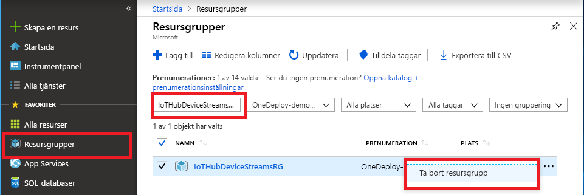

Om du planerar att fortsätta till nästa rekommenderade artikel kan du behålla och återanvända de resurser som du redan har skapat.

Annars kan du ta bort Azure-resurserna som du skapade i den här artikeln för att undvika avgifter.

> [!IMPORTANT]
> Att ta bort en resursgrupp kan inte ångras. Resursgruppen och alla resurser som ingår i den tas bort permanent. Var noga så att du inte tar bort fel resursgrupp eller resurser av misstag. Om du har skapat IoT-hubben i en befintlig resurs grupp som innehåller resurser som du vill behålla, tar du bara bort själva IoT Hub-resursen, inte resurs gruppen.
>

Ta bort en resursgrupp med namnet:

1. Logga in på [Azure-portalen](https://portal.azure.com) och välj **Resursgrupper**.

1. I rutan **Filtrera efter namn** anger du namnet på den resurs grupp som innehåller IoT-hubben.

1. I resultat listan till höger om din resurs grupp väljer du ellipsen (**...**) och väljer sedan **ta bort resurs grupp**.

    

1. Bekräfta borttagningen av resurs gruppen genom att ange namnet på resurs gruppen och välj sedan **ta bort**. Efter en liten stund tas resurs gruppen och alla resurser som finns kvar.
