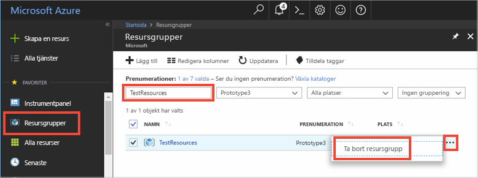

Om du ska fortsätta till nästa rekommenderade artikel kan du behålla de resurser som du redan har skapat och återanvända dem.

Annars kan du ta bort Azure-resurser som skapats i den här artikeln om du vill undvika kostnader. 

> [!IMPORTANT]
> Att ta bort en resursgrupp kan inte ångras. Resursgruppen och alla resurser som ingår i den tas bort permanent. Kontrollera att du inte av misstag tar bort fel resursgrupp eller resurser. Om du har skapat IoT Hub:en inuti en befintlig resursgrupp som innehåller resurser som du vill behålla, ta bara bort själva IoT Hub-resursen i stället för att ta bort resursgruppen.
>

Ta bort en resursgrupp med namnet:

1. Logga in på [Azure Portal](https://portal.azure.com) och välj **Resursgrupper**.

2. Skriv namnet på den resurs grupp som innehåller din IoT Hub i text rutan **Filtrera efter namn** . 

3. Till höger om resurs gruppen i resultat listan väljer du **...** och sedan **ta bort resurs grupp**.

    

4. Du blir ombedd att bekräfta borttagningen av resursgruppen. Skriv namnet på resurs gruppen igen för att bekräfta och välj sedan **ta bort**. Efter en liten stund tas resursgruppen och resurser som finns i den bort.