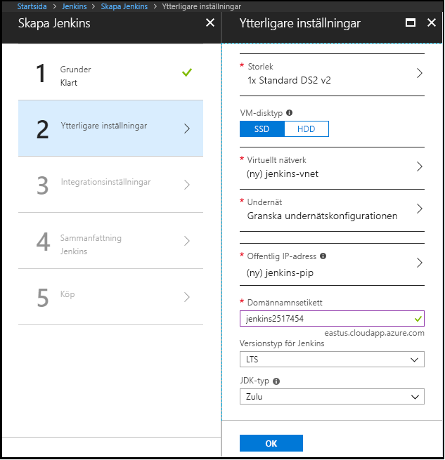

1. Öppna [Azure Marketplace-avbildningen för Jenkins](https://azuremarketplace.microsoft.com/marketplace/apps/azure-oss.jenkins?tab=Overview) i din webbläsare.

1. Välj **GET IT NOW** (Hämta nu).

    

1. När du har granskat prisinformationen och villkoren väljer du **Fortsätt**.

    

1. Välj **Skapa** för att konfigurera Jenkins-servern i Azure-portalen. 

    

1. På fliken **Grundläggande** anger du följande värden:

   - **Namn** – Ange `Jenkins`.
   - **Användarnamn** – ange det användarnamn som ska användas vid inloggning till den virtuella dator där Jenkins körs. Användarnamnet måste uppfylla [specifika krav](/azure/virtual-machines/linux/faq#what-are-the-username-requirements-when-creating-a-vm).
   - **Autentiseringstyp** – Välj **Offentlig SSH-nyckel**.
   - **Offentlig SSH-nyckel** – Kopiera och klistra in en offentlig RSA-nyckel i enradigt format (börja med `ssh-rsa`) eller flerradigt PEM-format. Du kan generera SSH-nycklar med hjälp av ssh-keygen i Linux och macOS eller PuTTYGen i Windows. Mer information om SSH-nycklar och Azure finns i artikeln [Så här använder du SSH-nycklar med Windows i Azure](/azure/virtual-machines/linux/ssh-from-windows).
   - **Prenumeration** – Välj den Azure-prenumeration där du vill installera Jenkins.
   - **Resursgrupp** – Välj **Skapa ny** och ange ett namn för den resursgrupp som fungerar som en logisk container för den samling med resurser som utgör din Jenkins-installation.
   - **Plats** – Välj **USA, östra**.

     

1. Välj **OK** för att fortsätta till fliken **Ytterligare inställningar**. 

1. På fliken **Ytterligare inställningar** anger du följande värden:

   - **Storlek** – Välj lämpligt storleksalternativ för den virtuella Jenkins-datorn.
   - **VM-disktyp** – Ange antingen HDD (hårddisk) eller SSD (solid state-hårddisk) för att ange vilken lagringsdisktyp som tillåts för den virtuella Jenkins-datorn.
   - **Virtuellt nätverk** – (Valfritt) Välj **virtuellt nätverk** för att ändra standardinställningarna.
   - **Undernät** – Välj **Undernät**, kontrollera informationen och välj **OK**.
   - **Offentlig IP-adress** – IP-adressnamnet är som standard det Jenkins-namn som du angav på föregående sida med suffixet -IP. Du kan välja alternativet för att ändra det standardvärdet.
   - **Domännamnsetikett** – Ange värdet för den fullständigt kvalificerade URL-adressen till den virtuella Jenkins-datorn.
   - **Jenkins-versionstyp** – Välj önskad versionstyp i alternativen: `LTS`, `Weekly build` eller `Azure Verified`. Alternativen `LTS` och `Weekly build` beskrivs i artikeln [Jenkins LTS Release Line](https://jenkins.io/download/lts/). Alternativet `Azure Verified` refererar till en [Jenkins LTS-version](https://jenkins.io/download/lts/) som har verifierats för att köras på Azure. 
   - **JDK-type** – JDK som ska installeras. Standardvärdet är Zulu-testade, certifierade versioner av OpenJDK.

     

1. Välj **OK** för att fortsätta till fliken **Integreringsinställningar**.

1. På fliken **Integreringsinställningar** anger du följande värden:

    - **Tjänstens huvudnamn** – Tjänstens huvudnamn läggs till i Jenkins som en autentiseringsuppgift för autentisering med Azure. `Auto` innebär att huvudkontot skapas av MSI (Hanterad tjänstidentitet). `Manual` innebär att huvudkontot ska skapas av dig. 
        - **Program-ID** och **Hemlighet** – Om du väljer alternativet `Manual` för alternativet **Tjänstens huvudnamn** måste du ange `Application ID` och `Secret` för din tjänstens huvudnamn. När du [skapar ett tjänsthuvudnamn](/cli/azure/create-an-azure-service-principal-azure-cli) bör du observera att standardrollen är **Deltagare**, vilket är tillräckligt för att arbeta med Azure-resurser.
    - **Aktivera molnagenter** – Ange standardmolnmall för agenter där `ACI` refererar till Azure Container Instance och `VM` refererar till virtuella datorer. Du kan även ange `No` om du inte vill aktivera en molnagent.

1. Välj **OK** för att fortsätta till fliken **Sammanfattning**.

1. När fliken **Sammanfattning** visas valideras den information som anges. När du ser meddelandet **Validation passed** (Valideringen lyckades) längst upp på fliken väljer du **OK**. 

     

1. När fliken **Skapa** visas väljer du **Skapa** för att skapa den virtuella Jenkins-datorn. När servern är klar visas ett meddelande i Azure-portalen.

     
