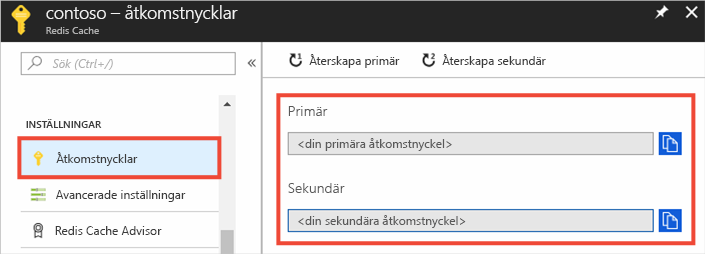
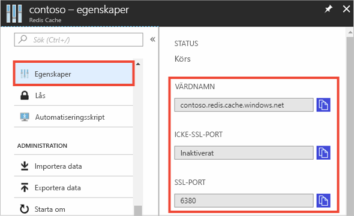

### Hämta värdnamn, portar och åtkomst nycklar från Azure Portal

För att ansluta till en Azure-cache för Redis-instansen behöver cache-klienterna värd namnet, portarna och en nyckel för cachen. Vissa klienter kan hänvisa till dessa objekt med namn som skiljer sig något. Du kan hämta värdnamn, portar och nycklar från [Azure Portal](https://portal.azure.com).

- Hämta åtkomst nycklarna genom att gå till vänster navigering i cachen och välja **åtkomst nycklar**. 
  
  

- För att hämta värd namnet och portarna, från din cache-vänstra navigering, väljer du **Egenskaper**. Värd namnet är av formatet *\<DNS name> . Redis.cache.Windows.net*.

  

