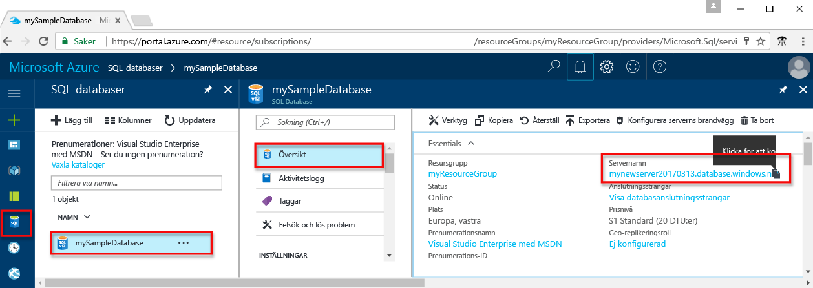

<!-- sql-database-connect-query-prerequisites-server-connection-info-includes.md 

## SQL server connection information
-->

Skaffa den anslutningsinformation du behöver för att ansluta till Azure SQL Database. Du behöver det fullständiga servernamnet, databasnamnet och inloggningsinformationen i nästa procedurer.

1. Logga in på [Azure-portalen](https://portal.azure.com/).
2. Välj **SQL-databaser** på den vänstra menyn och klicka på databasen på sidan **SQL-databaser**. 
3. Granska serverns fullständiga namn på sidan **Översikt** för databasen, se bilden nedan. Om du hovrar över servernamnet visas alternativet **Kopiera genom att klicka**.  

    

4. Om du glömmer inloggningsinformationen för din server öppnar du serversidan i SQL Database. Där ser du administratörsnamnet för servern. Du kan återställa lösenordet om det behövs.

