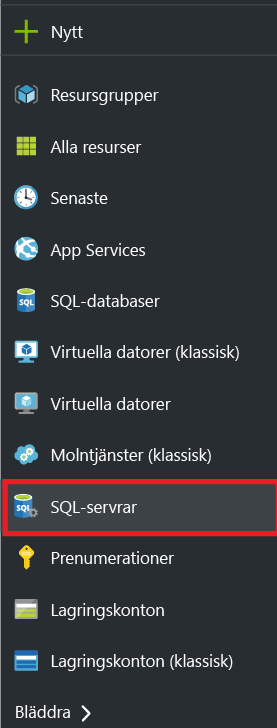
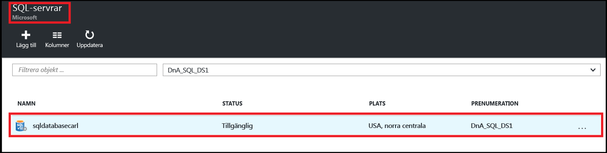
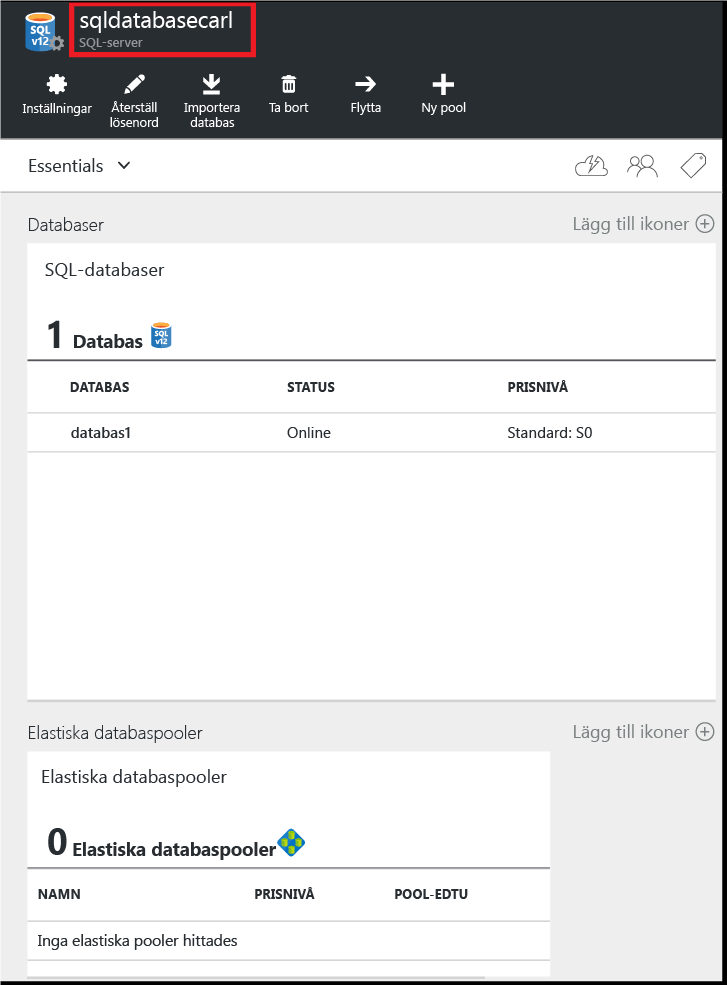
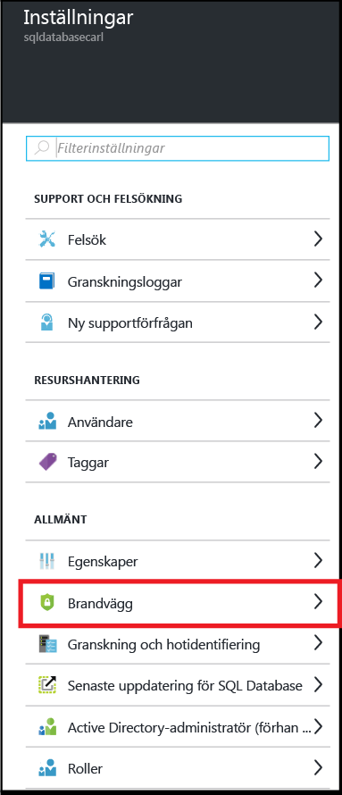
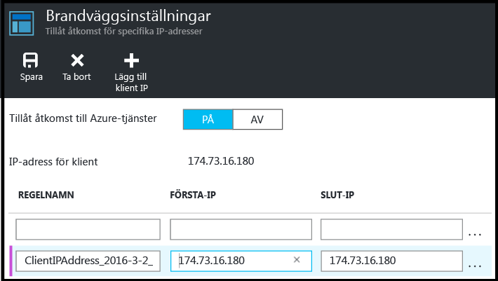
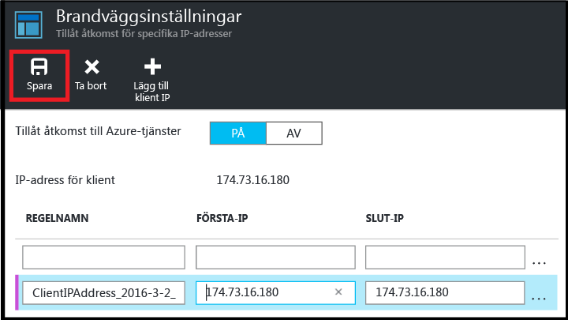

<!--
includes/sql-database-create-new-server-firewall-portal.md

Latest Freshness check:  2016-04-11 , carlrab.

As of circa 2016-04-11, the following topics might include this include:
articles/sql-database/sql-database-get-started-tutorial.md
articles/sql-database/sql-database-configure-firewall-settings

-->
## Skapa en ny brandvägg på Azure SQL-servernivå

Använd följande steg i Azure-portalen för att skapa en brandväggsregel på servernivå som tillåter anslutningar från en enskild IP-adress (din klientdator) eller ett helt IP-adressintervall till en logisk SQL-server. 

1. Om du inte är ansluten ansluter du till [Azure-portalen](http://portal.azure.com).
2. I standardbladet klickar du på **SQL Server**.

    

2. I SQL Server-bladet klickar du på SQL-servern som du vill skapa brandväggsregeln på. 

    
           
3. Granska egenskaperna för servern.

    
      
4. I Inställningar-bladet klickar du på **Brandvägg**.

    
    

    > [AZURE.IMPORTANT] Om du inte ser alternativet **Brandvägg** på bladet går du tillbaka och kontrollerar att du är på bladet för den logiska SQL Database-servern och inte på bladet för en SQL-databas.

5. Klicka på **Lägg till klient-IP** för att Azure ska skapa en regel för din klients IP-adress.

      ![ny serverbrandvägg]    (./media/sql-database-create-new-server-firewall-portal/sql-database-create-new-server-firewall-portal-5.png)

6. Du kan också klicka på IP-adressen som lades till om du vill redigera brandväggsadressen att tillåta åtkomst för ett IP-adressintervall.

      
    
7. Klicka på **Spara** för att skapa brandväggsregeln på servernivå.

     

    >[AZURE.IMPORTANT] Din klients IP-adress kan ändras, och det är möjligt att du inte får åtkomst till din server förrän du har skapat en ny brandväggsregel. Du kan kontrollera din IP-adress med hjälp av [Bing](http://www.bing.com/search?q=my%20ip%20address) och sedan lägga till antingen en enda IP-adress eller ett IP-adressintervall. Se [Hantera brandväggsinställningar](sql-database-configure-firewall-settings.md#manage-existing-server-level-firewall-rules-through-the-azure-portal) för mer information.

<!--HONumber=Jun16_HO2-->

