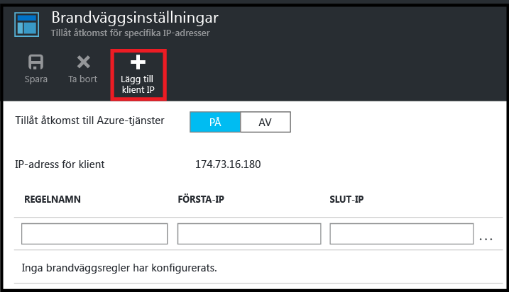

<!--
includes/sql-database-create-new-server-firewall-portal.md

Latest Freshness check:  2016-08-01 , rickbyh.

As of circa 2016-04-11, the following topics might include this include:
articles/sql-database/sql-database-get-started-tutorial.md
articles/sql-database/sql-database-configure-firewall-settings

-->
## Skapa en ny brandvägg på Azure SQL-servernivå
Använd följande steg i Azure Portal för att skapa en brandväggsregel på servernivå som tillåter anslutningar från en enskild IP-adress (din klientdator) eller ett helt IP-adressintervall till en logisk SQL Database-server.

1. Om du inte är ansluten ansluter du till [Azure Portal](http://portal.azure.com).
2. I standardbladet klickar du på **SQL-servrar**.
   
      
3. I **SQL server**-bladet klickar du på servern där du vill skapa brandväggsregeln.
   
     
4. Granska egenskaperna för servern.
   
     
5. I bladet **Inställningar** klickar du på **Brandvägg**.
   
     
   
   > [!NOTE]
   > Du kan även använda servernivån i bladet **brandväggsinställningar** från **databas**-bladets verktygsfält.
   > 
   > 
6. Klicka på **Lägg till klient-IP** för att Azure ska skapa en regel för din klients IP-adress.
   
      
7. Du kan också klicka på IP-adressen som lades till om du vill redigera brandväggsadressen att tillåta åtkomst för ett IP-adressintervall.
   
      
8. Klicka på **Spara** för att skapa brandväggsregeln på servernivå.
   
     
   
   > [!IMPORTANT]
   > IP-adress för klienten kan ändras, och det är möjligt att du inte får åtkomst till din server förrän du har skapat en ny brandväggsregel. Du kan kontrollera din IP-adress genom att använda [Bing](http://www.bing.com/search?q=my%20ip%20address). Lägg sedan till en IP-adress eller ett intervall med IP-adresser. Se [Hantera brandväggsinställningar](../articles/sql-database/sql-database-configure-firewall-settings.md#manage-existing-server-level-firewall-rules-through-the-azure-portal) för mer information.
   > 
   > 

<!--HONumber=Nov16_HO2-->

