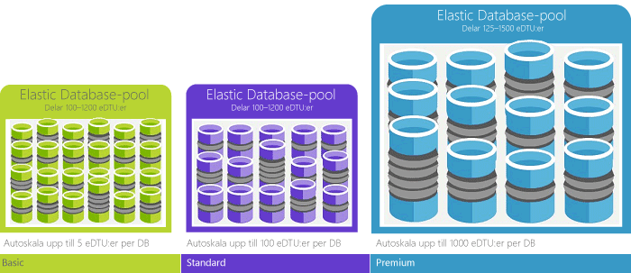

Databastransaktionsenheten (DTU) är den mätenhet i SQL Database som motsvarar den relativa kraften hos databaser baserat på ett verkligt mått: databastransaktionen. Vi har tagit en uppsättning åtgärder som är vanliga för en begäran om bearbetning av en online-transaktion (OLTP) och mätt hur många transaktioner som kunde slutföras per sekund under full belastning (kortfattat, fullständig information finns i [Benchmark-översikt](../articles/sql-database/sql-database-benchmark-overview.md)). 

En premium P11-databas med 1 750 DTU:er erbjuder exempelvis 350 gånger mer DTU-beräkningskraft än en grundläggande databas med 5 DTU:er. 

> [!NOTE]
> Om du migrerar en befintlig SQL Server-databas, kan du använda ett verktyg från tredje part, [Azure SQL Database DTU Calculator](http://dtucalculator.azurewebsites.net/), för att få en uppskattning av prestandanivå och servicenivå som din databas kan komma att behöva i Azure SQL Database.
> 
> 

### DTU jämfört med eDTU
DTU för enkla databaser kan direktöversättas till eDTU för elastiska databaser. En databas i en elastisk Basic-databaspool kan exempelvis erbjuda upp till 5 eDTU:er. Det är samma prestanda som en enkel Basic-databas. Skillnaden är att den elastiska databasen inte konsumerar några eDTU:er från poolen tills den behöver dem. 

Ett enkelt exempel kan hjälpa. Vi tar en elastisk Basic-databaspool med 1 000 DTU:er och lägger 800 databaser i den. Så länge som bara 200 av de 800 databaserna används på samma gång ( 5 DTU x 200 = 1 000), kommer inte poolens maxkapacitet att nås eller databasprestandan att försämras. Det här exemplet är något förenklat för tydlighetens skull. Den verkliga matten är lite mer invecklad. Portalen sköter dock matten åt dig och ger en rekommendation baserat på historisk databasanvändning. Se [Pris- och prestandaöverväganden för en elastisk databaspool](../articles/sql-database/sql-database-elastic-pool-guidance.md) om du vill lära dig hur rekommendationerna fungerar, eller om du vill göra dina egna beräkningar. 

<!--HONumber=Jun16_HO2-->

