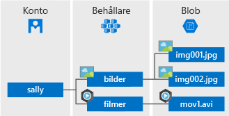

Azure Blob Storage är Microsofts objektlagringslösning för molnet. Blob Storage är optimerat för att lagra stora mängder ostrukturerade data, exempelvis text eller binära data.

Blob Storage är perfekt för:

* Leverera bilder eller dokument direkt till en webbläsare.
* Lagra filer för distribuerad åtkomst.
* Direktuppspelning av video och ljud.
* Skriva till loggfiler.
* Lagra data för säkerhetskopiering och återställning, haveriberedskap och arkivering.
* Lagra data för analys av en tjänst som kan vara lokal eller Azure-baserad.

Objekt i Blob storage kan nås från vilken plats som helst i världen via HTTP eller HTTPS. Användare eller klientprogram kan få åtkomst till blobar via URL-adresser, [Azure Storage REST API](https://docs.microsoft.com/rest/api/storageservices/blob-service-rest-api), [Azure PowerShell](https://docs.microsoft.com/powershell/module/azure.storage), [Azure CLI](https://docs.microsoft.com/cli/azure/storage) eller ett Azure Storage-klientbibliotek. Det finns lagringsklientbibliotek för flera språk, bland annat [.NET](https://docs.microsoft.com/dotnet/api/overview/azure/storage/client), [Java](https://docs.microsoft.com/java/api/overview/azure/storage/client), [Node.js](http://azure.github.io/azure-storage-node), [Python](https://docs.microsoft.com/python/azure/), [PHP](http://azure.github.io/azure-storage-php/) och [Ruby](http://azure.github.io/azure-storage-ruby).

## Blob Service-koncept

Blob Storage innehåller tre resurser: ditt lagringskonto, kontots behållare och behållarens blobbar. Följande diagram visar relationen mellan de här resurserna.

### Lagringskonto

All åtkomst till dataobjekt i Azure Storage sker via ett lagringskonto. Mer information finns i [Om Azure Storage-konton](../articles/storage/common/storage-create-storage-account.md?toc=%2fazure%2fstorage%2fblobs%2ftoc.json).

### Behållare

I en behållare ordnas en uppsättning blobbar, ungefär som en mapp i ett filsystem. Alla blobbar finns i en behållare. Ett lagringskonto kan innehålla ett obegränsat antal behållare, och varje behållare kan lagra ett obegränsat antal blobbar. Observera att behållarens namn får innehålla endast gemener.

### Blob
 
Azure Storage innehåller tre typer av blobbar – blockblobbar, tilläggsblobbar och [sidblobbar](../articles/storage/blobs/storage-blob-pageblob-overview.md) (används för VHD-filer).

* I blockblobbar lagras text och binära data, upp till ungefär 4,7 TB. Blockblobbar består av datablock som kan hanteras individuellt.
* Tilläggsblobbar består av block precis som blockblobbarna, men är optimerade för tilläggsåtgärder. Tilläggsblobbar passar utmärkt för åtgärder som att logga data från virtuella datorer.
* I sidblobbar lagras filer med slumpmässig åtkomst på upp till 8 TB. Sidblobbar lagrar VHD-filerna som stöder virtuella datorer.

Alla blobbar finns i en behållare. En behållare är ungefär som en mapp i ett filsystem. Du kan ordna blobbar i virtuella kataloger och bläddra i dem precis som i ett filsystem. 

För mycket stora datamängder där nätverksbegränsningar gör det orealistiskt att överföra eller hämta data till Blob Storage via kabel kan du skicka en uppsättning hårddiskar till Microsoft för att importera eller exportera data direkt från datacentret. Mer information finns i [Använda tjänsten Microsoft Azure Import/Export för att överföra data till Blob Storage](../articles/storage/common/storage-import-export-service.md).
  
Mer information om namngivning av behållare och blobbar finns i [Namngivning och referens av behållare, blobbar och metadata](/rest/api/storageservices/Naming-and-Referencing-Containers--Blobs--and-Metadata).
