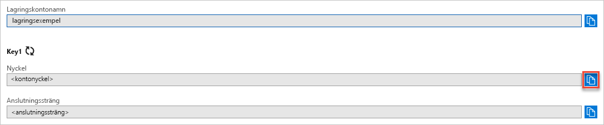

## Kopiera dina autentiseringsuppgifter från Azure-portalen

Exempelprogrammet måste autentisera åtkomsten till lagringskontot. När du vill autentisera tillhandahåller du autentiseringsuppgifterna för ditt lagringskonto i form av en anslutningssträng i programmet. Visa autentiseringsuppgifterna för lagringskontot:

1. Navigera till [Azure-portalen](https://portal.azure.com).
2. Leta rätt på ditt lagringskonto.
3. Välj **Åtkomstnycklar** i avsnittet **Inställningar** i lagringskontoöversikten. Åtkomstnycklarna för kontot visas, samt den fullständiga anslutningssträngen för varje nyckel.
4. Notera namnet på lagringskontot. Du behöver ange det under autentiseringen.   
5. Sök efter värdet för **Key** (Nyckel) **key1** och klicka på knappen **Kopiera** för att kopiera kontonyckeln.

    
