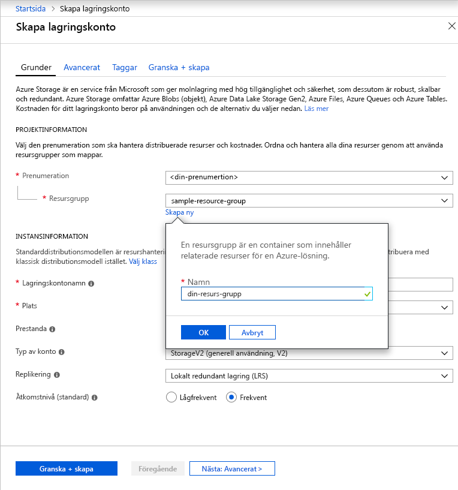

Följ de här stegen för att skapa ett GPv2-konto för generell användning i Azure-portalen:

1. I Azure-portalen expanderar du menyn på vänster sida för att öppna tjänstemenyn och välja **Alla tjänster**. Rulla ned till **lagring** och välj **lagringskonton**. På fönstret **lagringskonton** som visas, väljer du **lägg till**.
1. Välj den prenumeration där du vill skapa lagringskontot.
1. Under fältet **Resursgrupp** klickar du på **Skapa ny**. Ange ett namn för din nya resursgrupp som du ser i följande bild.

    

1. Ange sedan ett namn för lagringskontot. Namnet du väljer måste vara unikt för Azure, mellan 3 och 24 tecken långt och får endast innehålla siffror och gemener.
1. Välj en plats för ditt lagringskonto eller använd standardplatsen.
1. Lämna dessa fält med respektive standardvärde:
    - Fältet **Distributionsmodell** är inställt på **Resource Manager** som standard.
    - Fältet **Prestanda** är inställt på **Standard** som standard.
    - Fältet **Typ av konto** är inställt på **StorageV2 (generell användning v2)**.
    - Fältet **Replikering** är inställt på **Lokalt redundant lagring (LRS)** som standard.
    - **Åtkomstnivå** är inställt på **Frekvent** som standard.

1. Klicka på **Granska + skapa** för att granska inställningarna för ditt lagringskonto och skapa kontot.
1. Klicka på **Skapa**.

Mer information om typer av lagringskonton och andra inställningar för lagringskonto finns i [översikten över Azure-lagringskonton](https://docs.microsoft.com/azure/storage/common/storage-account-overview). Mer information om resursgrupper finns i [Översikt över Azure Resource Manager](https://docs.microsoft.com/azure/azure-resource-manager/resource-group-overview). 
